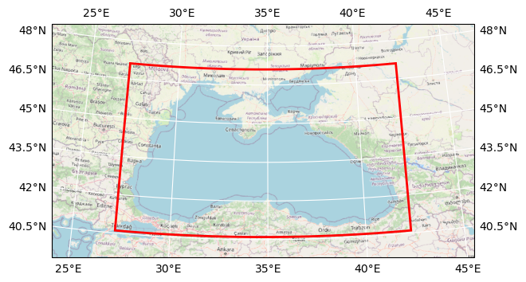

# DOORS METU BGC nutrients

## Basic information

 
Map tiles by <a href="http://stamen.com">Stamen Design</a>, under <a href="http://creativecommons.org/licenses/by/3.0">CC BY 3.0</a>. Data by <a href="http://openstreetmap.org">OpenStreetMap</a>, under <a href="http://www.openstreetmap.org/copyright">ODbL</a>.

| Parameter | Value |
| ---- | ---- |
| Bounding box latitude | 40.599998474121094 to 47.105201721191406 |
| Bounding box longitude | 27.200000762939453 to 42.2953987121582 |
| Time range | 2016-01-01T12:00:00 to 2016-03-31T12:00:00 |
| Contributor | METU |
| Creator | Brockmann Consult GmbH |

[Click here for full dataset metadata.](#full-metadata)

## Variable list

| Variable | Identifier | Units |
| ---- | ---- | ---- |
| [bivalent iron iron](#F2\_f) | F2\_f | umol Fe/m^3 |
| [trivalent iron iron](#F3\_f) | F3\_f | umol Fe/m^3 |
| [bivalent manganese manganese](#M2\_m) | M2\_m | umol Mn/m^3 |
| [trivalent manganese manganese](#M3\_m) | M3\_m | umol Mn/m^3 |
| [quadrivalent manganese manganese](#M4\_m) | M4\_m | umol Mn/m^3 |
| [phosphate phosphorus](#N1\_p) | N1\_p | mmol P/m^3 |
| [nitrite nitrogen](#N2\_n) | N2\_n | mmol N/m^3 |
| [nitrate nitrogen](#N3\_n) | N3\_n | mmol N/m^3 |
| [ammonium nitrogen](#N4\_n) | N4\_n | mmol N/m^3 |
| [silicate silicate](#N5\_s) | N5\_s | mmol Si/m^3 |
| [oxygen oxygen](#O2\_o) | O2\_o | mmol O\_2/m^3 |
| [hydrogen sulfide sulfur](#S1\_u) | S1\_u | mmol Su/m^3 |
| [elemental sulfur sulfur](#S2\_u) | S2\_u | mmol Su/m^3 |
| [sulfate sulfur](#S3\_u) | S3\_u | mmol Su/m^3 |
| [thiosulfate sulfur](#S4\_u) | S4\_u | mmol Su/m^3 |
| [\[none\]](#deptht\_bounds) | deptht\_bounds | \[none\] |
| [\[none\]](#time\_centered\_bounds) | time\_centered\_bounds | \[none\] |
| [\[none\]](#time\_counter\_bounds) | time\_counter\_bounds | \[none\] |

## Full variable metadata

### bivalent iron iron

| Field | Value |
| ---- | ---- |
| cell\_methods | time: mean \(interval: 360 s\) |
| interval\_operation | 360 s |
| interval\_write | 1 d |
| long\_name | bivalent iron iron |
| online\_operation | average |
| units | umol Fe/m^3 |

### trivalent iron iron

| Field | Value |
| ---- | ---- |
| cell\_methods | time: mean \(interval: 360 s\) |
| interval\_operation | 360 s |
| interval\_write | 1 d |
| long\_name | trivalent iron iron |
| online\_operation | average |
| units | umol Fe/m^3 |

### bivalent manganese manganese

| Field | Value |
| ---- | ---- |
| cell\_methods | time: mean \(interval: 360 s\) |
| interval\_operation | 360 s |
| interval\_write | 1 d |
| long\_name | bivalent manganese manganese |
| online\_operation | average |
| units | umol Mn/m^3 |

### trivalent manganese manganese

| Field | Value |
| ---- | ---- |
| cell\_methods | time: mean \(interval: 360 s\) |
| interval\_operation | 360 s |
| interval\_write | 1 d |
| long\_name | trivalent manganese manganese |
| online\_operation | average |
| units | umol Mn/m^3 |

### quadrivalent manganese manganese

| Field | Value |
| ---- | ---- |
| cell\_methods | time: mean \(interval: 360 s\) |
| interval\_operation | 360 s |
| interval\_write | 1 d |
| long\_name | quadrivalent manganese manganese |
| online\_operation | average |
| units | umol Mn/m^3 |

### phosphate phosphorus

| Field | Value |
| ---- | ---- |
| cell\_methods | time: mean \(interval: 360 s\) |
| interval\_operation | 360 s |
| interval\_write | 1 d |
| long\_name | phosphate phosphorus |
| online\_operation | average |
| units | mmol P/m^3 |

### nitrite nitrogen

| Field | Value |
| ---- | ---- |
| cell\_methods | time: mean \(interval: 360 s\) |
| interval\_operation | 360 s |
| interval\_write | 1 d |
| long\_name | nitrite nitrogen |
| online\_operation | average |
| units | mmol N/m^3 |

### nitrate nitrogen

| Field | Value |
| ---- | ---- |
| cell\_methods | time: mean \(interval: 360 s\) |
| interval\_operation | 360 s |
| interval\_write | 1 d |
| long\_name | nitrate nitrogen |
| online\_operation | average |
| units | mmol N/m^3 |

### ammonium nitrogen

| Field | Value |
| ---- | ---- |
| cell\_methods | time: mean \(interval: 360 s\) |
| interval\_operation | 360 s |
| interval\_write | 1 d |
| long\_name | ammonium nitrogen |
| online\_operation | average |
| units | mmol N/m^3 |

### silicate silicate

| Field | Value |
| ---- | ---- |
| cell\_methods | time: mean \(interval: 360 s\) |
| interval\_operation | 360 s |
| interval\_write | 1 d |
| long\_name | silicate silicate |
| online\_operation | average |
| units | mmol Si/m^3 |

### oxygen oxygen

| Field | Value |
| ---- | ---- |
| cell\_methods | time: mean \(interval: 360 s\) |
| interval\_operation | 360 s |
| interval\_write | 1 d |
| long\_name | oxygen oxygen |
| online\_operation | average |
| units | mmol O\_2/m^3 |

### hydrogen sulfide sulfur

| Field | Value |
| ---- | ---- |
| cell\_methods | time: mean \(interval: 360 s\) |
| interval\_operation | 360 s |
| interval\_write | 1 d |
| long\_name | hydrogen sulfide sulfur |
| online\_operation | average |
| units | mmol Su/m^3 |

### elemental sulfur sulfur

| Field | Value |
| ---- | ---- |
| cell\_methods | time: mean \(interval: 360 s\) |
| interval\_operation | 360 s |
| interval\_write | 1 d |
| long\_name | elemental sulfur sulfur |
| online\_operation | average |
| units | mmol Su/m^3 |

### sulfate sulfur

| Field | Value |
| ---- | ---- |
| cell\_methods | time: mean \(interval: 360 s\) |
| interval\_operation | 360 s |
| interval\_write | 1 d |
| long\_name | sulfate sulfur |
| online\_operation | average |
| units | mmol Su/m^3 |

### thiosulfate sulfur

| Field | Value |
| ---- | ---- |
| cell\_methods | time: mean \(interval: 360 s\) |
| interval\_operation | 360 s |
| interval\_write | 1 d |
| long\_name | thiosulfate sulfur |
| online\_operation | average |
| units | mmol Su/m^3 |

### None

| Field | Value |
| ---- | ---- |

### None

| Field | Value |
| ---- | ---- |

### None

| Field | Value |
| ---- | ---- |

## Full dataset metadata

| Field | Value |
| ---- | ---- |
| Conventions | CF\-1\.5 |
| TimeStamp | 02/05/2022 13:23:29 \+0300 |
| acknowledgment | DOORS project |
| contributor\_name | METU |
| contributor\_url | [https://www\.metu\.edu\.tr/](https://www.metu.edu.tr/) |
| creator\_email | info@brockmann\-consult\.de |
| creator\_name | Brockmann Consult GmbH |
| creator\_url | [www\.brockmann\-consult\.de](http://www.brockmann-consult.de) |
| date\_modified | 2023\-02\-08T19:52:27 |
| description | BGC nutrients |
| geospatial\_lat\_max | 47.105201721191406 |
| geospatial\_lon\_max | 42.2953987121582 |
| geospatial\_lat\_min | 40.599998474121094 |
| geospatial\_lon\_min | 27.200000762939453 |
| doors\_cube\_gen\_version | 0\.1 |
| ibegin | 1 |
| jbegin | 1 |
| name | BlackSea\_1d\_20160101\_20160331 |
| ni | 544 |
| nj | 2 |
| orig\_file\_name | BlackSea\_1d\_20160101\_20160331\_bgc\_nut\.nc |
| production | An IPSL model |
| project | DOORS |
| recipe | [https://github\.com/bcdev/doors\-recipes/cubegen/METU](https://github.com/bcdev/doors-recipes/cubegen/METU) |
| timeStamp | 2022\-May\-01 15:38:50 \+03 |
| time\_coverage\_end | 2016\-03\-31T12:00:00 |
| time\_coverage\_start | 2016\-01\-01T12:00:00 |
| title | DOORS METU BGC nutrients |

