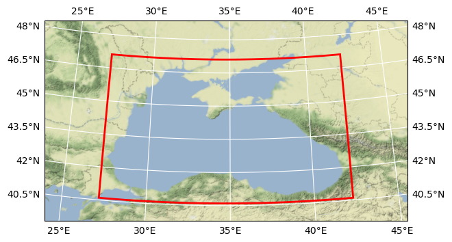

# DOORS METU BGC phytoplanktons

## Basic information

 
Map tiles by <a href="http://stamen.com">Stamen Design</a>, under <a href="http://creativecommons.org/licenses/by/3.0">CC BY 3.0</a>. Data by <a href="http://openstreetmap.org">OpenStreetMap</a>, under <a href="http://www.openstreetmap.org/copyright">ODbL</a>.

| Parameter | Value |
| ---- | ---- |
| Bounding box latitude | 40.599998474121094 to 47.105201721191406 |
| Bounding box longitude | 27.200000762939453 to 42.2953987121582 |
| Time range | 2016-01-01T12:00:00 to 2016-03-31T12:00:00 |
| Contributor | METU |
| Creator | Brockmann Consult GmbH |

[Click here for full dataset metadata.](#full-metadata)

## Variable list

| Variable | Identifier | Units |
| ---- | ---- | ---- |
| [diatoms chlorophyll a](#P1\_Chl) | P1\_Chl | mg/m^3 |
| [diatoms carbon](#P1\_c) | P1\_c | mg C/m^3 |
| [diatoms iron](#P1\_f) | P1\_f | umol Fe/m^3 |
| [diatoms nitrogen](#P1\_n) | P1\_n | mmol N/m^3 |
| [diatoms phosphorus](#P1\_p) | P1\_p | mmol P/m^3 |
| [diatoms silicate](#P1\_s) | P1\_s | mmol Si/m^3 |
| [nanophytoplankton chlorophyll a](#P2\_Chl) | P2\_Chl | mg/m^3 |
| [nanophytoplankton carbon](#P2\_c) | P2\_c | mg C/m^3 |
| [nanophytoplankton iron](#P2\_f) | P2\_f | umol Fe/m^3 |
| [nanophytoplankton nitrogen](#P2\_n) | P2\_n | mmol N/m^3 |
| [nanophytoplankton phosphorus](#P2\_p) | P2\_p | mmol P/m^3 |
| [picophytoplankton chlorophyll a](#P3\_Chl) | P3\_Chl | mg/m^3 |
| [picophytoplankton carbon](#P3\_c) | P3\_c | mg C/m^3 |
| [picophytoplankton iron](#P3\_f) | P3\_f | umol Fe/m^3 |
| [picophytoplankton nitrogen](#P3\_n) | P3\_n | mmol N/m^3 |
| [picophytoplankton phosphorus](#P3\_p) | P3\_p | mmol P/m^3 |
| [microphytoplankton chlorophyll a](#P4\_Chl) | P4\_Chl | mg/m^3 |
| [microphytoplankton carbon](#P4\_c) | P4\_c | mg C/m^3 |
| [microphytoplankton iron](#P4\_f) | P4\_f | umol Fe/m^3 |
| [microphytoplankton nitrogen](#P4\_n) | P4\_n | mmol N/m^3 |
| [microphytoplankton phosphorus](#P4\_p) | P4\_p | mmol P/m^3 |
| [\[none\]](#deptht\_bounds) | deptht\_bounds | \[none\] |
| [\[none\]](#time\_centered\_bounds) | time\_centered\_bounds | \[none\] |
| [\[none\]](#time\_counter\_bounds) | time\_counter\_bounds | \[none\] |

## Full variable metadata

### diatoms chlorophyll a

| Field | Value |
| ---- | ---- |
| cell\_methods | time: mean \(interval: 360 s\) |
| interval\_operation | 360 s |
| interval\_write | 1 d |
| long\_name | diatoms chlorophyll a |
| online\_operation | average |
| units | mg/m^3 |

### diatoms carbon

| Field | Value |
| ---- | ---- |
| cell\_methods | time: mean \(interval: 360 s\) |
| interval\_operation | 360 s |
| interval\_write | 1 d |
| long\_name | diatoms carbon |
| online\_operation | average |
| units | mg C/m^3 |

### diatoms iron

| Field | Value |
| ---- | ---- |
| cell\_methods | time: mean \(interval: 360 s\) |
| interval\_operation | 360 s |
| interval\_write | 1 d |
| long\_name | diatoms iron |
| online\_operation | average |
| units | umol Fe/m^3 |

### diatoms nitrogen

| Field | Value |
| ---- | ---- |
| cell\_methods | time: mean \(interval: 360 s\) |
| interval\_operation | 360 s |
| interval\_write | 1 d |
| long\_name | diatoms nitrogen |
| online\_operation | average |
| units | mmol N/m^3 |

### diatoms phosphorus

| Field | Value |
| ---- | ---- |
| cell\_methods | time: mean \(interval: 360 s\) |
| interval\_operation | 360 s |
| interval\_write | 1 d |
| long\_name | diatoms phosphorus |
| online\_operation | average |
| units | mmol P/m^3 |

### diatoms silicate

| Field | Value |
| ---- | ---- |
| cell\_methods | time: mean \(interval: 360 s\) |
| interval\_operation | 360 s |
| interval\_write | 1 d |
| long\_name | diatoms silicate |
| online\_operation | average |
| units | mmol Si/m^3 |

### nanophytoplankton chlorophyll a

| Field | Value |
| ---- | ---- |
| cell\_methods | time: mean \(interval: 360 s\) |
| interval\_operation | 360 s |
| interval\_write | 1 d |
| long\_name | nanophytoplankton chlorophyll a |
| online\_operation | average |
| units | mg/m^3 |

### nanophytoplankton carbon

| Field | Value |
| ---- | ---- |
| cell\_methods | time: mean \(interval: 360 s\) |
| interval\_operation | 360 s |
| interval\_write | 1 d |
| long\_name | nanophytoplankton carbon |
| online\_operation | average |
| units | mg C/m^3 |

### nanophytoplankton iron

| Field | Value |
| ---- | ---- |
| cell\_methods | time: mean \(interval: 360 s\) |
| interval\_operation | 360 s |
| interval\_write | 1 d |
| long\_name | nanophytoplankton iron |
| online\_operation | average |
| units | umol Fe/m^3 |

### nanophytoplankton nitrogen

| Field | Value |
| ---- | ---- |
| cell\_methods | time: mean \(interval: 360 s\) |
| interval\_operation | 360 s |
| interval\_write | 1 d |
| long\_name | nanophytoplankton nitrogen |
| online\_operation | average |
| units | mmol N/m^3 |

### nanophytoplankton phosphorus

| Field | Value |
| ---- | ---- |
| cell\_methods | time: mean \(interval: 360 s\) |
| interval\_operation | 360 s |
| interval\_write | 1 d |
| long\_name | nanophytoplankton phosphorus |
| online\_operation | average |
| units | mmol P/m^3 |

### picophytoplankton chlorophyll a

| Field | Value |
| ---- | ---- |
| cell\_methods | time: mean \(interval: 360 s\) |
| interval\_operation | 360 s |
| interval\_write | 1 d |
| long\_name | picophytoplankton chlorophyll a |
| online\_operation | average |
| units | mg/m^3 |

### picophytoplankton carbon

| Field | Value |
| ---- | ---- |
| cell\_methods | time: mean \(interval: 360 s\) |
| interval\_operation | 360 s |
| interval\_write | 1 d |
| long\_name | picophytoplankton carbon |
| online\_operation | average |
| units | mg C/m^3 |

### picophytoplankton iron

| Field | Value |
| ---- | ---- |
| cell\_methods | time: mean \(interval: 360 s\) |
| interval\_operation | 360 s |
| interval\_write | 1 d |
| long\_name | picophytoplankton iron |
| online\_operation | average |
| units | umol Fe/m^3 |

### picophytoplankton nitrogen

| Field | Value |
| ---- | ---- |
| cell\_methods | time: mean \(interval: 360 s\) |
| interval\_operation | 360 s |
| interval\_write | 1 d |
| long\_name | picophytoplankton nitrogen |
| online\_operation | average |
| units | mmol N/m^3 |

### picophytoplankton phosphorus

| Field | Value |
| ---- | ---- |
| cell\_methods | time: mean \(interval: 360 s\) |
| interval\_operation | 360 s |
| interval\_write | 1 d |
| long\_name | picophytoplankton phosphorus |
| online\_operation | average |
| units | mmol P/m^3 |

### microphytoplankton chlorophyll a

| Field | Value |
| ---- | ---- |
| cell\_methods | time: mean \(interval: 360 s\) |
| interval\_operation | 360 s |
| interval\_write | 1 d |
| long\_name | microphytoplankton chlorophyll a |
| online\_operation | average |
| units | mg/m^3 |

### microphytoplankton carbon

| Field | Value |
| ---- | ---- |
| cell\_methods | time: mean \(interval: 360 s\) |
| interval\_operation | 360 s |
| interval\_write | 1 d |
| long\_name | microphytoplankton carbon |
| online\_operation | average |
| units | mg C/m^3 |

### microphytoplankton iron

| Field | Value |
| ---- | ---- |
| cell\_methods | time: mean \(interval: 360 s\) |
| interval\_operation | 360 s |
| interval\_write | 1 d |
| long\_name | microphytoplankton iron |
| online\_operation | average |
| units | umol Fe/m^3 |

### microphytoplankton nitrogen

| Field | Value |
| ---- | ---- |
| cell\_methods | time: mean \(interval: 360 s\) |
| interval\_operation | 360 s |
| interval\_write | 1 d |
| long\_name | microphytoplankton nitrogen |
| online\_operation | average |
| units | mmol N/m^3 |

### microphytoplankton phosphorus

| Field | Value |
| ---- | ---- |
| cell\_methods | time: mean \(interval: 360 s\) |
| interval\_operation | 360 s |
| interval\_write | 1 d |
| long\_name | microphytoplankton phosphorus |
| online\_operation | average |
| units | mmol P/m^3 |

### None

| Field | Value |
| ---- | ---- |

### None

| Field | Value |
| ---- | ---- |

### None

| Field | Value |
| ---- | ---- |

## Full dataset metadata

| Field | Value |
| ---- | ---- |
| Conventions | CF\-1\.5 |
| TimeStamp | 02/05/2022 12:28:17 \+0300 |
| acknowledgment | DOORS project |
| contributor\_name | METU |
| contributor\_url | [https://www\.metu\.edu\.tr/](https://www.metu.edu.tr/) |
| creator\_email | info@brockmann\-consult\.de |
| creator\_name | Brockmann Consult GmbH |
| creator\_url | [www\.brockmann\-consult\.de](http://www.brockmann-consult.de) |
| date\_modified | 2023\-02\-08T20:52:00 |
| description | BGC phytoplanktons |
| geospatial\_lat\_max | 47.105201721191406 |
| geospatial\_lon\_max | 42.2953987121582 |
| geospatial\_lat\_min | 40.599998474121094 |
| geospatial\_lon\_min | 27.200000762939453 |
| doors\_cube\_gen\_version | 0\.1 |
| ibegin | 1 |
| jbegin | 1 |
| name | BlackSea\_1d\_20160101\_20160331 |
| ni | 544 |
| nj | 2 |
| orig\_file\_name | BlackSea\_1d\_20160101\_20160331\_bgc\_phyto\.nc |
| production | An IPSL model |
| project | DOORS |
| recipe | [https://github\.com/bcdev/doors\-recipes/cubegen/METU](https://github.com/bcdev/doors-recipes/cubegen/METU) |
| timeStamp | 2022\-May\-01 15:38:50 \+03 |
| time\_coverage\_end | 2016\-03\-31T12:00:00 |
| time\_coverage\_start | 2016\-01\-01T12:00:00 |
| title | DOORS METU BGC phytoplanktons |

