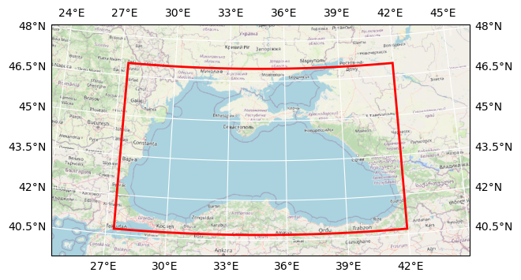

# DOORS METU bio

## Basic information

 
Map tiles and Data by <a href="http://openstreetmap.org">OpenStreetMap</a>, under <a href="http://www.openstreetmap.org/copyright">ODbL</a>.

| Parameter | Value |
| ---- | ---- |
| Bounding box latitude | 40.70000076293945 to 46.970001220703125 |
| Bounding box longitude | 27.399999618530273 to 41.959999084472656 |
| Time range | 2018-01-01T12:00:00 to 2018-12-31T12:00:00 |
| Contributor | METU |
| Creator | Brockmann Consult GmbH |

[Click here for full dataset metadata.](#full-metadata)

## Variable list

| Variable | Identifier | Units |
| ---- | ---- | ---- |
| [diatoms carbon](#P1\_c) | P1\_c | mg C/m^3 |
| [diatoms nitrogen](#P1\_n) | P1\_n | mmol N/m^3 |
| [diatoms phosphorus](#P1\_p) | P1\_p | mmol P/m^3 |
| [diatoms silicate](#P1\_s) | P1\_s | mmol Si/m^3 |
| [nanophytoplankton carbon](#P2\_c) | P2\_c | mg C/m^3 |
| [nanophytoplankton nitrogen](#P2\_n) | P2\_n | mmol N/m^3 |
| [nanophytoplankton phosphorus](#P2\_p) | P2\_p | mmol P/m^3 |
| [picophytoplankton carbon](#P3\_c) | P3\_c | mg C/m^3 |
| [picophytoplankton nitrogen](#P3\_n) | P3\_n | mmol N/m^3 |
| [picophytoplankton phosphorus](#P3\_p) | P3\_p | mmol P/m^3 |
| [microphytoplankton carbon](#P4\_c) | P4\_c | mg C/m^3 |
| [microphytoplankton nitrogen](#P4\_n) | P4\_n | mmol N/m^3 |
| [microphytoplankton phosphorus](#P4\_p) | P4\_p | mmol P/m^3 |

## Full variable metadata

### diatoms carbon

| Field | Value |
| ---- | ---- |
| cell\_methods | time: mean \(interval: 480 s\) |
| interval\_operation | 480 s |
| interval\_write | 1 d |
| long\_name | diatoms carbon |
| online\_operation | average |
| units | mg C/m^3 |

### diatoms nitrogen

| Field | Value |
| ---- | ---- |
| cell\_methods | time: mean \(interval: 480 s\) |
| interval\_operation | 480 s |
| interval\_write | 1 d |
| long\_name | diatoms nitrogen |
| online\_operation | average |
| units | mmol N/m^3 |

### diatoms phosphorus

| Field | Value |
| ---- | ---- |
| cell\_methods | time: mean \(interval: 480 s\) |
| interval\_operation | 480 s |
| interval\_write | 1 d |
| long\_name | diatoms phosphorus |
| online\_operation | average |
| units | mmol P/m^3 |

### diatoms silicate

| Field | Value |
| ---- | ---- |
| cell\_methods | time: mean \(interval: 480 s\) |
| interval\_operation | 480 s |
| interval\_write | 1 d |
| long\_name | diatoms silicate |
| online\_operation | average |
| units | mmol Si/m^3 |

### nanophytoplankton carbon

| Field | Value |
| ---- | ---- |
| cell\_methods | time: mean \(interval: 480 s\) |
| interval\_operation | 480 s |
| interval\_write | 1 d |
| long\_name | nanophytoplankton carbon |
| online\_operation | average |
| units | mg C/m^3 |

### nanophytoplankton nitrogen

| Field | Value |
| ---- | ---- |
| cell\_methods | time: mean \(interval: 480 s\) |
| interval\_operation | 480 s |
| interval\_write | 1 d |
| long\_name | nanophytoplankton nitrogen |
| online\_operation | average |
| units | mmol N/m^3 |

### nanophytoplankton phosphorus

| Field | Value |
| ---- | ---- |
| cell\_methods | time: mean \(interval: 480 s\) |
| interval\_operation | 480 s |
| interval\_write | 1 d |
| long\_name | nanophytoplankton phosphorus |
| online\_operation | average |
| units | mmol P/m^3 |

### picophytoplankton carbon

| Field | Value |
| ---- | ---- |
| cell\_methods | time: mean \(interval: 480 s\) |
| interval\_operation | 480 s |
| interval\_write | 1 d |
| long\_name | picophytoplankton carbon |
| online\_operation | average |
| units | mg C/m^3 |

### picophytoplankton nitrogen

| Field | Value |
| ---- | ---- |
| cell\_methods | time: mean \(interval: 480 s\) |
| interval\_operation | 480 s |
| interval\_write | 1 d |
| long\_name | picophytoplankton nitrogen |
| online\_operation | average |
| units | mmol N/m^3 |

### picophytoplankton phosphorus

| Field | Value |
| ---- | ---- |
| cell\_methods | time: mean \(interval: 480 s\) |
| interval\_operation | 480 s |
| interval\_write | 1 d |
| long\_name | picophytoplankton phosphorus |
| online\_operation | average |
| units | mmol P/m^3 |

### microphytoplankton carbon

| Field | Value |
| ---- | ---- |
| cell\_methods | time: mean \(interval: 480 s\) |
| interval\_operation | 480 s |
| interval\_write | 1 d |
| long\_name | microphytoplankton carbon |
| online\_operation | average |
| units | mg C/m^3 |

### microphytoplankton nitrogen

| Field | Value |
| ---- | ---- |
| cell\_methods | time: mean \(interval: 480 s\) |
| interval\_operation | 480 s |
| interval\_write | 1 d |
| long\_name | microphytoplankton nitrogen |
| online\_operation | average |
| units | mmol N/m^3 |

### microphytoplankton phosphorus

| Field | Value |
| ---- | ---- |
| cell\_methods | time: mean \(interval: 480 s\) |
| interval\_operation | 480 s |
| interval\_write | 1 d |
| long\_name | microphytoplankton phosphorus |
| online\_operation | average |
| units | mmol P/m^3 |

## Full dataset metadata

| Field | Value |
| ---- | ---- |
| Conventions | CF\-1\.5 |
| TimeStamp | 17/05/2024 17:49:28 \+0300 |
| acknowledgment | DOORS project |
| contributor\_name | METU |
| contributor\_url | [https://www\.metu\.edu\.tr/](https://www.metu.edu.tr/) |
| creator\_email | info@brockmann\-consult\.de |
| creator\_name | Brockmann Consult GmbH |
| creator\_url | [www\.brockmann\-consult\.de](http://www.brockmann-consult.de) |
| date\_modified | 2024\-10\-11T16:01:37 |
| description | bio |
| doors\_cube\_gen\_version | 0\.2\.dev0 |
| geospatial\_lat\_max | 46.970001220703125 |
| geospatial\_lat\_min | 40.70000076293945 |
| geospatial\_lon\_max | 41.959999084472656 |
| geospatial\_lon\_min | 27.399999618530273 |
| ibegin | 1 |
| jbegin | 1 |
| name | BlackSea\_1d\_20180101\_20181231 |
| ni | 365 |
| nj | 11 |
| orig\_file\_name | BlackSea\_1d\_20180101\_20181231\_bio\.nc |
| production | An IPSL model |
| project | DOORS |
| recipe | [https://github\.com/bcdev/doors\-recipes/cubegen/METU](https://github.com/bcdev/doors-recipes/cubegen/METU) |
| timeStamp | 2024\-May\-02 11:23:45 \+03 |
| time\_coverage\_end | 2018\-12\-31T12:00:00 |
| time\_coverage\_start | 2018\-01\-01T12:00:00 |
| title | DOORS METU bio |

