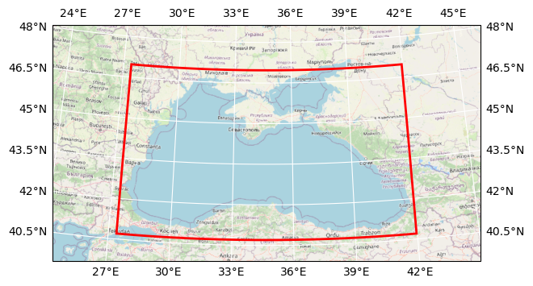

# DOORS METU ocean T grid variables

## Basic information

 
Map tiles and Data by <a href="http://openstreetmap.org">OpenStreetMap</a>, under <a href="http://www.openstreetmap.org/copyright">ODbL</a>.

| Parameter | Value |
| ---- | ---- |
| Bounding box latitude | 40.70000076293945 to 46.970001220703125 |
| Bounding box longitude | 27.399999618530273 to 41.959999084472656 |
| Time range | 2018-01-01T12:00:00 to 2018-12-31T12:00:00 |
| Contributor | METU |
| Creator | Brockmann Consult GmbH |

[Click here for full dataset metadata.](#full-metadata)

## Variable list

| Variable | Identifier | Units |
| ---- | ---- | ---- |
| [potential density \(sigma0\)](#rhop) | rhop | kg/m3 |
| [Net Downward Heat Flux](#sohefldo) | sohefldo | W/m2 |
| [Turbocline depth \(Kz = 5e\-4\)](#somixhgt) | somixhgt | m |
| [Mixed Layer Depth \(dsigma = 0\.01 wrt 10m\)](#somxl010) | somxl010 | m |
| [sea surface salinity](#sosaline) | sosaline | 1e\-3 |
| [Downward salt flux](#sosfldow) | sosfldow | 1e\-3/m2/s |
| [Shortwave Radiation](#soshfldo) | soshfldo | W/m2 |
| [sea surface height](#sossheig) | sossheig | m |
| [sea surface temperature](#sosstsst) | sosstsst | degC |
| [Net Upward Water Flux](#sowaflup) | sowaflup | kg/m2/s |
| [salinity](#vosaline) | vosaline | 1e\-3 |
| [temperature](#votemper) | votemper | degC |

## Full variable metadata

### potential density (sigma0)

| Field | Value |
| ---- | ---- |
| cell\_methods | time: mean \(interval: 480 s\) |
| interval\_operation | 480 s |
| interval\_write | 1 d |
| long\_name | potential density \(sigma0\) |
| online\_operation | average |
| standard\_name | sea\_water\_sigma\_theta |
| units | kg/m3 |

### Net Downward Heat Flux

| Field | Value |
| ---- | ---- |
| cell\_methods | time: mean \(interval: 480 s\) |
| interval\_operation | 480 s |
| interval\_write | 1 d |
| long\_name | Net Downward Heat Flux |
| online\_operation | average |
| standard\_name | surface\_downward\_heat\_flux\_in\_sea\_water |
| units | W/m2 |

### Turbocline depth (Kz = 5e-4)

| Field | Value |
| ---- | ---- |
| cell\_methods | time: mean \(interval: 480 s\) |
| interval\_operation | 480 s |
| interval\_write | 1 d |
| long\_name | Turbocline depth \(Kz = 5e\-4\) |
| online\_operation | average |
| standard\_name | ocean\_mixed\_layer\_thickness\_defined\_by\_vertical\_tracer\_diffusivity |
| units | m |

### Mixed Layer Depth (dsigma = 0.01 wrt 10m)

| Field | Value |
| ---- | ---- |
| cell\_methods | time: mean \(interval: 480 s\) |
| interval\_operation | 480 s |
| interval\_write | 1 d |
| long\_name | Mixed Layer Depth \(dsigma = 0\.01 wrt 10m\) |
| online\_operation | average |
| standard\_name | ocean\_mixed\_layer\_thickness\_defined\_by\_sigma\_theta |
| units | m |

### sea surface salinity

| Field | Value |
| ---- | ---- |
| cell\_methods | time: mean \(interval: 480 s\) |
| interval\_operation | 480 s |
| interval\_write | 1 d |
| long\_name | sea surface salinity |
| online\_operation | average |
| standard\_name | sea\_surface\_salinity |
| units | 1e\-3 |

### Downward salt flux

| Field | Value |
| ---- | ---- |
| cell\_methods | time: mean \(interval: 480 s\) |
| interval\_operation | 480 s |
| interval\_write | 1 d |
| long\_name | Downward salt flux |
| online\_operation | average |
| units | 1e\-3/m2/s |

### Shortwave Radiation

| Field | Value |
| ---- | ---- |
| cell\_methods | time: point \(interval: 12 h\) |
| interval\_operation | 12 h |
| interval\_write | 1 d |
| long\_name | Shortwave Radiation |
| online\_operation | instant |
| standard\_name | net\_downward\_shortwave\_flux\_at\_sea\_water\_surface |
| units | W/m2 |

### sea surface height

| Field | Value |
| ---- | ---- |
| cell\_methods | time: mean \(interval: 480 s\) |
| interval\_operation | 480 s |
| interval\_write | 1 d |
| long\_name | sea surface height |
| online\_operation | average |
| standard\_name | sea\_surface\_height\_above\_geoid |
| units | m |

### sea surface temperature

| Field | Value |
| ---- | ---- |
| cell\_methods | time: mean \(interval: 480 s\) |
| interval\_operation | 480 s |
| interval\_write | 1 d |
| long\_name | sea surface temperature |
| online\_operation | average |
| standard\_name | sea\_surface\_temperature |
| units | degC |

### Net Upward Water Flux

| Field | Value |
| ---- | ---- |
| cell\_methods | time: mean \(interval: 480 s\) |
| interval\_operation | 480 s |
| interval\_write | 1 d |
| long\_name | Net Upward Water Flux |
| online\_operation | average |
| standard\_name | water\_flux\_out\_of\_sea\_ice\_and\_sea\_water |
| units | kg/m2/s |

### salinity

| Field | Value |
| ---- | ---- |
| cell\_methods | time: mean \(interval: 480 s\) |
| interval\_operation | 480 s |
| interval\_write | 1 d |
| long\_name | salinity |
| online\_operation | average |
| standard\_name | sea\_water\_practical\_salinity |
| units | 1e\-3 |

### temperature

| Field | Value |
| ---- | ---- |
| cell\_methods | time: mean \(interval: 480 s\) |
| interval\_operation | 480 s |
| interval\_write | 1 d |
| long\_name | temperature |
| online\_operation | average |
| standard\_name | sea\_water\_potential\_temperature |
| units | degC |

## Full dataset metadata

| Field | Value |
| ---- | ---- |
| Conventions | CF\-1\.5 |
| TimeStamp | 06/05/2024 15:19:54 \+0300 |
| acknowledgment | DOORS project |
| contributor\_name | METU |
| contributor\_url | [https://www\.metu\.edu\.tr/](https://www.metu.edu.tr/) |
| creator\_email | info@brockmann\-consult\.de |
| creator\_name | Brockmann Consult GmbH |
| creator\_url | [www\.brockmann\-consult\.de](http://www.brockmann-consult.de) |
| date\_modified | 2025\-05\-03T16:58:56 |
| description | ocean T grid variables |
| doors\_cube\_gen\_version | 0\.2\.dev0 |
| geospatial\_lat\_max | 46.970001220703125 |
| geospatial\_lat\_min | 40.70000076293945 |
| geospatial\_lon\_max | 41.959999084472656 |
| geospatial\_lon\_min | 27.399999618530273 |
| ibegin | 1 |
| jbegin | 1 |
| name | BlackSea\_1d\_20180101\_20181231 |
| ni | 365 |
| nj | 11 |
| orig\_file\_name | BlackSea\_1d\_20180101\_20181231\_grid\_T\.nc |
| production | An IPSL model |
| project | DOORS |
| recipe | [https://github\.com/bcdev/doors\-recipes/cubegen/METU](https://github.com/bcdev/doors-recipes/cubegen/METU) |
| timeStamp | 2024\-May\-02 11:21:56 \+03 |
| time\_coverage\_end | 2018\-12\-31T12:00:00 |
| time\_coverage\_start | 2018\-01\-01T12:00:00 |
| title | DOORS METU ocean T grid variables |

