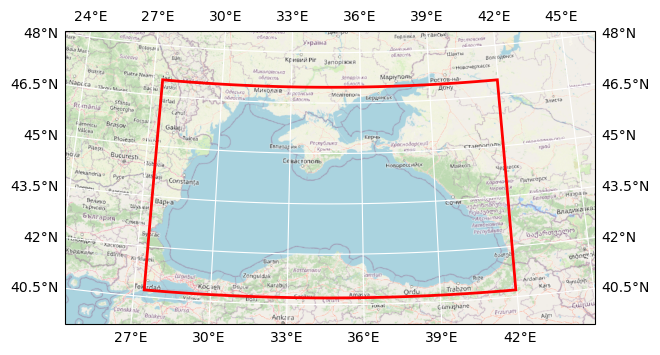

# DOORS METU nutrients

## Basic information

 
Map tiles and Data by <a href="http://openstreetmap.org">OpenStreetMap</a>, under <a href="http://www.openstreetmap.org/copyright">ODbL</a>.

| Parameter | Value |
| ---- | ---- |
| Bounding box latitude | 40.70000076293945 to 46.970001220703125 |
| Bounding box longitude | 27.399999618530273 to 41.959999084472656 |
| Time range | 2018-01-01T12:00:00 to 2018-12-31T12:00:00 |
| Contributor | METU |
| Creator | Brockmann Consult GmbH |

[Click here for full dataset metadata.](#full-metadata)

## Variable list

| Variable | Identifier | Units |
| ---- | ---- | ---- |
| [phosphate phosphorus](#N1\_p) | N1\_p | mmol P/m^3 |
| [nitrite nitrogen](#N2\_n) | N2\_n | mmol N/m^3 |
| [nitrate nitrogen](#N3\_n) | N3\_n | mmol N/m^3 |
| [ammonium nitrogen](#N4\_n) | N4\_n | mmol N/m^3 |
| [silicate silicate](#N5\_s) | N5\_s | mmol Si/m^3 |
| [oxygen oxygen](#O2\_o) | O2\_o | mmol O\_2/m^3 |

## Full variable metadata

### phosphate phosphorus

| Field | Value |
| ---- | ---- |
| cell\_methods | time: mean \(interval: 480 s\) |
| interval\_operation | 480 s |
| interval\_write | 1 d |
| long\_name | phosphate phosphorus |
| online\_operation | average |
| units | mmol P/m^3 |

### nitrite nitrogen

| Field | Value |
| ---- | ---- |
| cell\_methods | time: mean \(interval: 480 s\) |
| interval\_operation | 480 s |
| interval\_write | 1 d |
| long\_name | nitrite nitrogen |
| online\_operation | average |
| units | mmol N/m^3 |

### nitrate nitrogen

| Field | Value |
| ---- | ---- |
| cell\_methods | time: mean \(interval: 480 s\) |
| interval\_operation | 480 s |
| interval\_write | 1 d |
| long\_name | nitrate nitrogen |
| online\_operation | average |
| units | mmol N/m^3 |

### ammonium nitrogen

| Field | Value |
| ---- | ---- |
| cell\_methods | time: mean \(interval: 480 s\) |
| interval\_operation | 480 s |
| interval\_write | 1 d |
| long\_name | ammonium nitrogen |
| online\_operation | average |
| units | mmol N/m^3 |

### silicate silicate

| Field | Value |
| ---- | ---- |
| cell\_methods | time: mean \(interval: 480 s\) |
| interval\_operation | 480 s |
| interval\_write | 1 d |
| long\_name | silicate silicate |
| online\_operation | average |
| units | mmol Si/m^3 |

### oxygen oxygen

| Field | Value |
| ---- | ---- |
| cell\_methods | time: mean \(interval: 480 s\) |
| interval\_operation | 480 s |
| interval\_write | 1 d |
| long\_name | oxygen oxygen |
| online\_operation | average |
| units | mmol O\_2/m^3 |

## Full dataset metadata

| Field | Value |
| ---- | ---- |
| Conventions | CF\-1\.5 |
| TimeStamp | 03/05/2024 12:28:12 \+0300 |
| acknowledgment | DOORS project |
| contributor\_name | METU |
| contributor\_url | [https://www\.metu\.edu\.tr/](https://www.metu.edu.tr/) |
| creator\_email | info@brockmann\-consult\.de |
| creator\_name | Brockmann Consult GmbH |
| creator\_url | [www\.brockmann\-consult\.de](http://www.brockmann-consult.de) |
| date\_modified | 2024\-10\-15T16:56:00 |
| description | nutrients |
| doors\_cube\_gen\_version | 0\.2\.dev0 |
| geospatial\_lat\_max | 46.970001220703125 |
| geospatial\_lat\_min | 40.70000076293945 |
| geospatial\_lon\_max | 41.959999084472656 |
| geospatial\_lon\_min | 27.399999618530273 |
| ibegin | 1 |
| jbegin | 1 |
| name | BlackSea\_1d\_20180101\_20181231 |
| ni | 365 |
| nj | 11 |
| orig\_file\_name | BlackSea\_1d\_20180101\_20181231\_nut\.nc |
| production | An IPSL model |
| project | DOORS |
| recipe | [https://github\.com/bcdev/doors\-recipes/cubegen/METU](https://github.com/bcdev/doors-recipes/cubegen/METU) |
| timeStamp | 2024\-May\-02 11:23:44 \+03 |
| time\_coverage\_end | 2018\-12\-31T12:00:00 |
| time\_coverage\_start | 2018\-01\-01T12:00:00 |
| title | DOORS METU nutrients |

