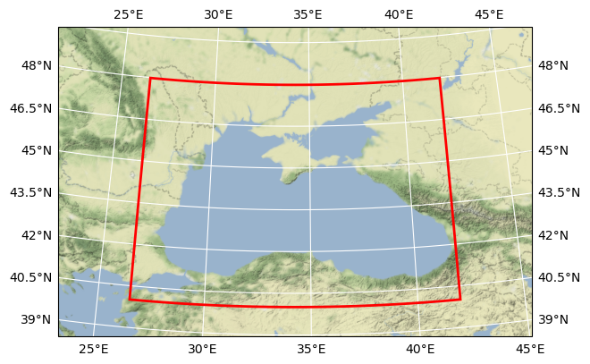

# CMEMS CHL Black Sea

## Basic information

 
Map tiles by <a href="http://stamen.com">Stamen Design</a>, under <a href="http://creativecommons.org/licenses/by/3.0">CC BY 3.0</a>. Data by <a href="http://openstreetmap.org">OpenStreetMap</a>, under <a href="http://www.openstreetmap.org/copyright">ODbL</a>.

[Click here for full dataset metadata.](#full-metadata)

## Variable list

| Variable | Identifier | Units |
| ---- | ---- | ---- |
| [Chlorophyll\-a concentration](#CHL) | CHL | mg m^\-3 |

## Full variable metadata

### Chlorophyll-a concentration

| Field | Value |
| ---- | ---- |
| description | Multi\-sensor, multi water\-type, interpolated Chlorophyll a concentration\. |
| long\_name | Chlorophyll\-a concentration |
| source | [Click here for source.](CMEMS_OC_BS_4.zarr-CHL.md) |
| standard\_name | mass\_concentration\_of\_chlorophyll\_a\_in\_sea\_water |
| type | surface |
| units | mg m^\-3 |
| valid\_max | 20 |
| valid\_min | 0 |

## Full dataset metadata

| Field | Value |
| ---- | ---- |
| Conventions | CF\-1\.7 |
| citation |   |
| cmems\_product\_id | OCEANCOLOUR\_BS\_CHL\_L4\_NRT\_OBSERVATIONS\_009\_045 |
| cmems\_production\_unit | OC\-CNR\-ROMA\-IT |
| comment |   |
| contact | technical@gos\.artov\.isac\.cnr\.it |
| creation\_date | Thu Apr 08 2021 |
| creation\_time | 06:04:22 UTC |
| date\_created | 2022\-01\-20T08:28:54\.206742 |
| days\_in\_the\_future |  5 |
| days\_in\_the\_past |  10 |
| distribution\_statement | See CMEMS Data License |
| easternmost\_longitude | 42.0 |
| file\_quality\_index | 0 |
| geospatial\_bounds | POLYGON\(\(26\.507038 40\.005062, 26\.507038 47\.985062, 41\.987038 47\.985062, 41\.987038 40\.005062, 26\.507038 40\.005062\)\) |
| geospatial\_bounds\_crs | CRS84 |
| geospatial\_lat\_max | 47.985062 |
| geospatial\_lat\_min | 40.005062 |
| geospatial\_lat\_resolution | 0.02 |
| geospatial\_lat\_units | degrees\_north |
| geospatial\_lon\_max | 41.987038 |
| geospatial\_lon\_min | 26.507038 |
| geospatial\_lon\_resolution | 0.02 |
| geospatial\_lon\_units | degrees\_east |
| grid\_mapping | Equirectangular |
| grid\_resolution |   1 Km |
| history |  , {'cube_config': {'bbox': [26.507038, 40.005062, 41.99296, 47.994938], 'metadata': {'title': 'CMEMS Black Sea Chl'}, 'spatial_res': 0.02, 'tile_size': [512, 512], 'time_period': '1D', 'time_range': ['2019-01-01', '2021-03-15'], 'variable_names': ['CHL']}, 'program': 'xcube gen2, version 0.9.2'} |
| institution | CNR\-GOS |
| naming\_authority | CMEMS |
| netcdf\_version | v4 |
| northernmost\_latitude | 48.0 |
| parameter | chlorophyll\-a concentration |
| parameter\_code | CHL |
| platform | Aqua,JPSS\-1,Sentinel\-3a,Suomi\-NPP |
| product\_level | L4 |
| product\_version | v02QL |
| references | 1\) Zibordi, G\., F\. Mélin, J\.\-F\. Berthon, and M\. Talone \(2015\)\. In situ autonomous optical radiometry measurements for satellite ocean color validation in the Western Black Sea\. Ocean Sci\., 11, 275–286, 2015 \- 2\) Kajiyama T\., D\. D’Alimonte, and G\. Zibordi, “Algorithms merging for the determination of Chlorophyll\-a concentration in the Black Sea,” IEEE Geoscience and Remote Sensing Letters, 2018\. https://www\.doi\.org/10\.1109/LGRS\.2018\.2883539 \- 3\) Volpe, G\., Buongiorno Nardelli, B\., Colella, S\., Pisano, A\. and Santoleri, R\. \(2018\)\. An Operational Interpolated Ocean Colour Product in the Mediterranean Sea, in New Frontiers in Operational Oceanography, edited by E\. P\. Chassignet, A\. Pascual, J\. Tintorè, and J\. Verron, pp\. 227–244 |
| sensor | MODISA Moderate Resolution Imaging Spectroradiometer,VIIRSJ Visible Infrared Imaging Radiometer Suite,OLCI Ocean and Land Colour Instrument,VIIRSN Visible Infrared Imaging Radiometer Suite |
| sensor\_name | MODISA,VIIRSJ,OLCI,VIIRSN |
| site\_name | BS |
| software\_name | GOS Processing chain |
| software\_version | v3\.0 |
| source | surface observation |
| source\_files | X2021065\-chl\-bs\-hr\.nc X2021066\-chl\-bs\-hr\.nc X2021067\-chl\-bs\-hr\.nc X2021068\-chl\-bs\-hr\.nc X2021069\-chl\-bs\-hr\.nc X2021070\-chl\-bs\-hr\.nc X2021071\-chl\-bs\-hr\.nc X2021072\-chl\-bs\-hr\.nc X2021073\-chl\-bs\-hr\.nc X2021074\-chl\-bs\-hr\.nc X2021075\-chl\-bs\-hr\.nc X2021076\-chl\-bs\-hr\.nc X2021077\-chl\-bs\-hr\.nc X2021078\-chl\-bs\-hr\.nc |
| southernmost\_latitude | 40.0 |
| st\_location |  4  0 |
| start\_date | 2021\-03\-15 |
| start\_time | 08:00:00 UTC |
| stop\_date | 2021\-03\-15 |
| stop\_time | 14:00:00 UTC |
| title | CMEMS CHL Black Sea |
| westernmost\_longitude | 26.5 |

