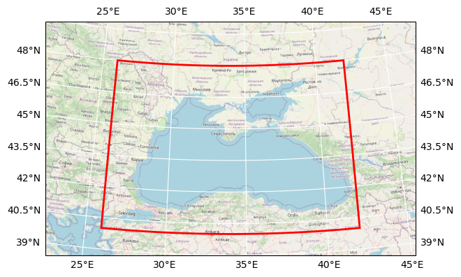

# HR-OC Coastal Daily Black Sea

## Basic information

 
Map tiles and Data by <a href="http://openstreetmap.org">OpenStreetMap</a>, under <a href="http://www.openstreetmap.org/copyright">ODbL</a>.

| Parameter | Value |
| ---- | ---- |
| Bounding box latitude | 40.0 to 48.0 |
| Bounding box longitude | 26.00000000000003 to 42.00000000000003 |
| Creator | BC, RBINS, and VITO for CMEMS |

[Click here for full dataset metadata.](#full-metadata)

## Variable list

| Variable | Identifier | Units |
| ---- | ---- | ---- |
| [Chlorophyll\-a concentration derived from MSI L2R using HR\-OC L2W processor](#CHL) | CHL | mg m\-3 |
| [Suspended Particulate Matter derived from MSI L2R using HR\-OC L2W processor](#SPM) | SPM | g m\-3 |
| [Turbidity derived from MSI L2R using HR\-OC L2W processor](#TUR) | TUR | FNU |

## Full variable metadata

### Chlorophyll-a concentration derived from MSI L2R using HR-OC L2W processor

| Field | Value |
| ---- | ---- |
| long\_name | Chlorophyll\-a concentration derived from MSI L2R using HR\-OC L2W processor |
| standard\_name | mass\_concentration\_of\_chlorophyll\_a\_in\_sea\_water |
| units | mg m\-3 |
| valid\_max | 20.0 |
| valid\_min | 0.0 |

### Suspended Particulate Matter derived from MSI L2R using HR-OC L2W processor

| Field | Value |
| ---- | ---- |
| long\_name | Suspended Particulate Matter derived from MSI L2R using HR\-OC L2W processor |
| standard\_name | mass\_concentration\_of\_suspended\_matter\_in\_sea\_water |
| units | g m\-3 |
| valid\_max | 50.0 |
| valid\_min | 0.0 |

### Turbidity derived from MSI L2R using HR-OC L2W processor

| Field | Value |
| ---- | ---- |
| long\_name | Turbidity derived from MSI L2R using HR\-OC L2W processor |
| standard\_name | sea\_water\_turbidity |
| units | FNU |
| valid\_max | 50.0 |
| valid\_min | 0.0 |

## Full dataset metadata

| Field | Value |
| ---- | ---- |
| Conventions | CF\-1\.7 |
| TileSize | 540:1008 |
| base\_data\_id | cmems\_obs\_oc\_blk\_bgc\_tur\-spm\-chl\_nrt\_l4\-hr\-mosaic\_P1D\-m |
| base\_dataset | OCEANCOLOUR\_BLK\_BGC\_HR\_L4\_NRT\_009\_212 |
| cmd\_data\_type | Grid |
| cmems\_dataset | cmems\_obs\_oc\_blk\_bgc\_tur\-spm\-chl\_nrt\_l4\-hr\-mosaic\_P1D\-m |
| cmems\_product\_id | OCEANCOLOUR\_BLK\_BGC\_HR\_L4\_NRT\_009\_212 |
| contact | [https://marine\.copernicus\.eu/](https://marine.copernicus.eu/) |
| creator\_email | hr\-oc\-servicedesk@brockmann\-consult\.de |
| creator\_name | BC, RBINS, and VITO for CMEMS |
| creator\_url | [https://www\.brockmann\-consult\.de/](https://www.brockmann-consult.de/) |
| date\_created | 20210812T143343Z |
| geospatial\_lat\_max | 48\.0 |
| geospatial\_lat\_min | 40\.0 |
| geospatial\_lat\_resolution | 9\.25925925925926E\-4 |
| geospatial\_lat\_units | degrees\_north |
| geospatial\_lon\_max | 42\.00000000000003 |
| geospatial\_lon\_min | 26\.00000000000003 |
| geospatial\_lon\_resolution | 0\.001322751322751323 |
| geospatial\_lon\_units | degrees\_east |
| geospatial\_vertical\_max | 0 |
| geospatial\_vertical\_min | 0 |
| history | Calvalus 2\.21 mosaic generation; Acolite 20210203; C2RCC 8\.0cv; Idepix 8\.0cv; HROC L2W 20201223; Calvalus 2\.21 aggregation |
| id | 20200102\_P1D\_CMEMS\_HROC\_L4\_tur\-spm\-chl\_BLK\_\_100m\-v01\.2\.nc |
| institution | Brockmann Consult GmbH, RBINS, VITO for CMEMS, Mercator Ocean |
| keywords | ocean color, water quality, reflectance, Copernicus CMEMS |
| keywords\_vocabulary | NASA Global Change Master Directory \(GCMD\) Science keywords |
| license | CMEMS data license |
| naming\_authority | org\.esa\-cci |
| platform | Sentinel\-2 |
| product\_version | v01\.2 |
| project | CMEMS High Resolution Ocean Colour |
| references | [https://marine\.copernicus\.eu/](https://marine.copernicus.eu/) |
| region | BLK |
| sensor | MSI |
| source | Sentinel\-2 MSI L1C |
| spatial\_resolution | 100m |
| standard\_name\_vocabulary | NetCDF Climate and Forecast \(CF\) Metadata Convention |
| start\_date | 02\-JAN\-2020 00:00:00\.000000 |
| stop\_date | 02\-JAN\-2020 00:00:00\.000000 |
| summary | The HR\-OC product has been processed from Sentinel\-2 MSI L1C by pixel identification, atmospheric correction, in\-water retrieval, spatio\-temporal aggregation, and tiling\. It covers six European coastal regions\. |
| tile |  |
| time\_coverage\_duration | P1D |
| time\_coverage\_resolution | P1D |
| time\_coverage\_start | 20200102T000000Z |
| time\_coverage\_stop | 20200102T235959Z |
| title | HR\-OC Coastal Daily Black Sea |
| tracking\_id | baaf82f0\-7a27\-4890\-beb8\-400986668cbb |

