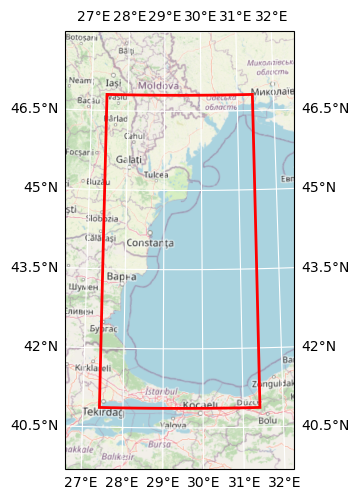

# DOORS Hereon Wave Products (2D) - Instantaneous Field

## Basic information

 
Map tiles by <a href="http://stamen.com">Stamen Design</a>, under <a href="http://creativecommons.org/licenses/by/3.0">CC BY 3.0</a>. Data by <a href="http://openstreetmap.org">OpenStreetMap</a>, under <a href="http://www.openstreetmap.org/copyright">ODbL</a>.

| Parameter | Value |
| ---- | ---- |
| Bounding box latitude | 40.87083053588867 to 46.804161071777344 |
| Bounding box longitude | 27.412500381469727 to 31.42083168029785 |
| Time range | 2021-11-01T00:00:00 to 2021-11-30T23:00:00 |
| Time period | 1H |
| Contributor | Hereon |
| Creator | Brockmann Consult GmbH |

[Click here for full dataset metadata.](#full-metadata)

## Variable list

| Variable | Identifier | Units |
| ---- | ---- | ---- |
| [Spectral significant wave height \(Hm0\)](#VHM0) | VHM0 | m |
| [Mean wave direction from \(Mdir\)](#VMDR) | VMDR | degree |
| [Stokes drift U](#VSDX) | VSDX | m/s |
| [Stokes drift V](#VSDY) | VSDY | m/s |
| [Spectral moments \(0,2\) wave period \(Tm02\)](#VTM02) | VTM02 | s |
| [Wave period at spectral peak / peak period \(Tp\)](#VTPK) | VTPK | s |

## Full variable metadata

### Spectral significant wave height (Hm0)

| Field | Value |
| ---- | ---- |
| Coordinates | time lat lon |
| long\_name | Spectral significant wave height \(Hm0\) |
| standard\_name | sea\_surface\_wave\_significant\_height |
| units | m |
| valid\_max | 20.0 |
| valid\_min | 0.0 |

### Mean wave direction from (Mdir)

| Field | Value |
| ---- | ---- |
| Coordinates | time lat lon |
| long\_name | Mean wave direction from \(Mdir\) |
| standard\_name | sea\_surface\_wave\_from\_direction |
| units | degree |
| valid\_max | 360.0 |
| valid\_min | 0.0 |

### Stokes drift U

| Field | Value |
| ---- | ---- |
| Coordinates | time lat lon |
| long\_name | Stokes drift U |
| standard\_name | sea\_surface\_wave\_stokes\_drift\_x\_velocity |
| units | m/s |
| valid\_max | 1.0 |
| valid\_min | -1.0 |

### Stokes drift V

| Field | Value |
| ---- | ---- |
| Coordinates | time lat lon |
| long\_name | Stokes drift V |
| standard\_name | sea\_surface\_wave\_stokes\_drift\_y\_velocity |
| units | m/s |
| valid\_max | 1.0 |
| valid\_min | -1.0 |

### Spectral moments (0,2) wave period (Tm02)

| Field | Value |
| ---- | ---- |
| Coordinates | time lat lon |
| long\_name | Spectral moments \(0,2\) wave period \(Tm02\) |
| standard\_name | sea\_surface\_wave\_mean\_period\_from\_variance\_spectral\_density\_second\_frequency\_moment |
| units | s |
| valid\_max | 20.0 |
| valid\_min | 1.0 |

### Wave period at spectral peak / peak period (Tp)

| Field | Value |
| ---- | ---- |
| Coordinates | time lat lon |
| long\_name | Wave period at spectral peak / peak period \(Tp\) |
| standard\_name | sea\_surface\_wave\_period\_at\_variance\_spectral\_density\_maximum |
| units | s |
| valid\_max | 30.0 |
| valid\_min | 1.0 |

## Full dataset metadata

| Field | Value |
| ---- | ---- |
| NCO | netCDF Operators version 4\.7\.5 \(Homepage = http://nco\.sf\.net, Code = http://github\.com/nco/nco\) |
| acknowledgment | DOORS project |
| bulletim\_type | reanalysis |
| bulletin\_date | 20230123 |
| comment | Please check in CMEMS catalogue the INFO section for product BLKSEA\_ANALYSISFORECAST\_WAV\_007\_006 \- http://marine\.copernicus\.eu |
| contact | servicedesk\.cmems@mercator\-ocean\.eu |
| contributor\_name | Hereon |
| contributor\_url | [https://hereon\.de/](https://hereon.de/) |
| conventions | CF\-1\.6 |
| creator\_email | info@brockmann\-consult\.de |
| creator\_name | Brockmann Consult GmbH |
| creator\_url | [www\.brockmann\-consult\.de](http://www.brockmann-consult.de) |
| date\_modified | 2023\-02\-08T19:48:32 |
| doors\_cube\_gen\_version | 0\.1 |
| field\_type | hourly\_instantaneous\_at\_time\_field |
| geospatial\_lat\_max | 46.804161071777344 |
| geospatial\_lon\_max | 31.42083168029785 |
| geospatial\_lat\_min | 40.87083053588867 |
| geospatial\_lon\_min | 27.412500381469727 |
| history | Thu Jan 26 16:03:16 2023: ncks \-v VHM0,VTPK,VTM02,VMDR,VSDX,VSDY 20211130\_h\-Hereon\-\-WAVES\-BSeas4\-BS\-b20230123\_re\-sv08\.00\.nc sample\.nc |
| institution | Helmholtz\-Zentrum Hereon, Germany |
| project | DOORS |
| recipe | [https://github\.com/bcdev/doors\-recipes/cubegen/Hereon](https://github.com/bcdev/doors-recipes/cubegen/Hereon) |
| references | Please check in CMEMS catalogue the INFO section for product BLKSEA\_ANALYSISFORECAST\_WAV\_007\_006 \- http://marine\.copernicus\.eu |
| source | WAM Cycle 6 |
| time\_coverage\_end | 2021\-11\-30T23:00:00 |
| time\_coverage\_start | 2021\-11\-01T00:00:00 |
| time\_period | 1H |
| title | Wave Products \(2D\) \- Instantaneous Field |

