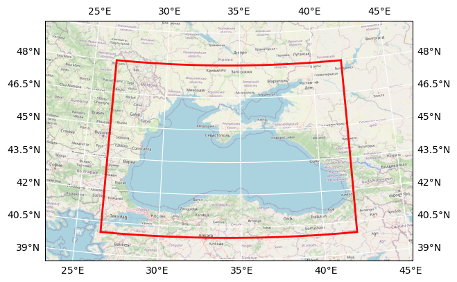

# DOORS PML Optical Water Types (CERTO v1)

## Basic information

 
Map tiles and Data by <a href="http://openstreetmap.org">OpenStreetMap</a>, under <a href="http://www.openstreetmap.org/copyright">ODbL</a>.

| Parameter | Value |
| ---- | ---- |
| Bounding box latitude | 40.00111607142857 to 47.99888392857143 |
| Bounding box longitude | 26.501116071428573 to 41.99888392857143 |
| Time range | 2016-04-26T07:58:07 to 2021-08-10T07:30:00 |
| Contributor | PML |
| Creator | Brockmann Consult GmbH |

[Click here for full dataset metadata.](#full-metadata)

## Variable list

| Variable                        | Identifier | Units |
|---------------------------------| ---- | ---- |
| [OWT\_1](#OWT\_1)               | OWT\_1 | membership % |
| [OWT\_10](#OWT\_10)             | OWT\_10 | membership % |
| [OWT\_11](#OWT\_11)             | OWT\_11 | membership % |
| [OWT\_12](#OWT\_12)             | OWT\_12 | membership % |
| [OWT\_13](#OWT\_13)             | OWT\_13 | membership % |
| [OWT\_14](#OWT\_14)             | OWT\_14 | membership % |
| [OWT\_15](#OWT\_15)             | OWT\_15 | membership % |
| [OWT\_16](#OWT\_16)             | OWT\_16 | membership % |
| [OWT\_17](#OWT\_17)             | OWT\_17 | membership % |
| [OWT\_18](#OWT\_18)             | OWT\_18 | membership % |
| [OWT\_2](#OWT\_2)               | OWT\_2 | membership % |
| [OWT\_3](#OWT\_3)               | OWT\_3 | membership % |
| [OWT\_4](#OWT\_4)               | OWT\_4 | membership % |
| [OWT\_5](#OWT\_5)               | OWT\_5 | membership % |
| [OWT\_6](#OWT\_6)               | OWT\_6 | membership % |
| [OWT\_7](#OWT\_7)               | OWT\_7 | membership % |
| [OWT\_8](#OWT\_8)               | OWT\_8 | membership % |
| [OWT\_9](#OWT\_9)               | OWT\_9 | membership % |
| [dominant\_OWT](#dominant\_OWT) | dominant\_OWT | \[none\] |

## Full variable metadata

### OWT_1

| Field | Value |
| ---- | ---- |
| Conventions | CF\-1\.4 |
| TileSize | 64:64 |
| aggregation\_period | 1D |
| color\_bar\_name | binary |
| comment |  |
| contacts | calimnos\-support@pml\.ac\.uk |
| copyright | Plymouth Marine Laboratory |
| credit | Lake Surface Reflectance, Turbidity and Chlorophyll\-a concentration were produced by Plymouth Marine Laboratory for the EU H2020 MONOCLE project |
| gcmd\_keywords | EARTH\_SCIENCE\-OCEANS\-OCEAN\_OPTICS\-WATER\-LEAVING RADIANCE;EARTH\_SCIENCE\-TERRESTRIAL\_HYDROSPHERE\-WATER\_QUALITY\_WATER\_CHEMISTRY\-CHLOROPHYLL,SUSPENDED\_SOLIDS,TURBIDITY |
| gemet\_keywords | water; algal bloom; aquatic environment; freshwater; freshwater quality; inland water; lagoon; lake; dam; phytoplankton; turbidity; water monitoring; water quality; water reservoir; climate; seasonal variation; environmental data; environmental monitoring; monitoring; remote sensing |
| inspire\_theme | Orthoimagery |
| iso19115\_topic\_categories | environment |
| platform | PLATFORM |
| processing\_centre | Plymouth Marine Laboratory |
| processing\_level | L3\_Aggregated |
| processing\_time | 2021\-08\-12T16:17:57\.857316 |
| processor | Calimnos |
| product\_type | CF\-1\.4 |
| product\_version | 1\.4\.0 |
| project | MONOCLE |
| purpose | This product was produced for the EU H2020 MONOCLE project |
| resolution | 300 |
| sensor | OLCI |
| software\_version | 1\.4 |
| time\_coverage\_end | 10\-AUG\-2021 07:30:00\.000000 |
| time\_coverage\_start | 26\-APR\-2016 07:58:34\.713243 |
| title | Optical Water Type 1 |
| trackingID | af107da0\-a2cd\-4e72\-9f35\-018ac52f98b9 |
| units | membership % |
| valid\_max | 1.0 |
| valid\_min | 0.0 |

### OWT_10

| Field | Value |
| ---- | ---- |
| Conventions | CF\-1\.4 |
| TileSize | 64:64 |
| aggregation\_period | 1D |
| color\_bar\_name | binary |
| comment |  |
| contacts | calimnos\-support@pml\.ac\.uk |
| copyright | Plymouth Marine Laboratory |
| credit | Lake Surface Reflectance, Turbidity and Chlorophyll\-a concentration were produced by Plymouth Marine Laboratory for the EU H2020 MONOCLE project |
| gcmd\_keywords | EARTH\_SCIENCE\-OCEANS\-OCEAN\_OPTICS\-WATER\-LEAVING RADIANCE;EARTH\_SCIENCE\-TERRESTRIAL\_HYDROSPHERE\-WATER\_QUALITY\_WATER\_CHEMISTRY\-CHLOROPHYLL,SUSPENDED\_SOLIDS,TURBIDITY |
| gemet\_keywords | water; algal bloom; aquatic environment; freshwater; freshwater quality; inland water; lagoon; lake; dam; phytoplankton; turbidity; water monitoring; water quality; water reservoir; climate; seasonal variation; environmental data; environmental monitoring; monitoring; remote sensing |
| inspire\_theme | Orthoimagery |
| iso19115\_topic\_categories | environment |
| platform | PLATFORM |
| processing\_centre | Plymouth Marine Laboratory |
| processing\_level | L3\_Aggregated |
| processing\_time | 2021\-08\-12T16:17:57\.857316 |
| processor | Calimnos |
| product\_type | CF\-1\.4 |
| product\_version | 1\.4\.0 |
| project | MONOCLE |
| purpose | This product was produced for the EU H2020 MONOCLE project |
| resolution | 300 |
| sensor | OLCI |
| software\_version | 1\.4 |
| time\_coverage\_end | 10\-AUG\-2021 07:30:00\.000000 |
| time\_coverage\_start | 26\-APR\-2016 07:58:34\.713243 |
| title | Optical Water Type 10 |
| trackingID | af107da0\-a2cd\-4e72\-9f35\-018ac52f98b9 |
| units | membership % |
| valid\_max | 1.0 |
| valid\_min | 0.0 |

### OWT_11

| Field | Value |
| ---- | ---- |
| Conventions | CF\-1\.4 |
| TileSize | 64:64 |
| aggregation\_period | 1D |
| color\_bar\_name | binary |
| comment |  |
| contacts | calimnos\-support@pml\.ac\.uk |
| copyright | Plymouth Marine Laboratory |
| credit | Lake Surface Reflectance, Turbidity and Chlorophyll\-a concentration were produced by Plymouth Marine Laboratory for the EU H2020 MONOCLE project |
| gcmd\_keywords | EARTH\_SCIENCE\-OCEANS\-OCEAN\_OPTICS\-WATER\-LEAVING RADIANCE;EARTH\_SCIENCE\-TERRESTRIAL\_HYDROSPHERE\-WATER\_QUALITY\_WATER\_CHEMISTRY\-CHLOROPHYLL,SUSPENDED\_SOLIDS,TURBIDITY |
| gemet\_keywords | water; algal bloom; aquatic environment; freshwater; freshwater quality; inland water; lagoon; lake; dam; phytoplankton; turbidity; water monitoring; water quality; water reservoir; climate; seasonal variation; environmental data; environmental monitoring; monitoring; remote sensing |
| inspire\_theme | Orthoimagery |
| iso19115\_topic\_categories | environment |
| platform | PLATFORM |
| processing\_centre | Plymouth Marine Laboratory |
| processing\_level | L3\_Aggregated |
| processing\_time | 2021\-08\-12T16:17:57\.857316 |
| processor | Calimnos |
| product\_type | CF\-1\.4 |
| product\_version | 1\.4\.0 |
| project | MONOCLE |
| purpose | This product was produced for the EU H2020 MONOCLE project |
| resolution | 300 |
| sensor | OLCI |
| software\_version | 1\.4 |
| time\_coverage\_end | 10\-AUG\-2021 07:30:00\.000000 |
| time\_coverage\_start | 26\-APR\-2016 07:58:34\.713243 |
| title | Optical Water Type 11 |
| trackingID | af107da0\-a2cd\-4e72\-9f35\-018ac52f98b9 |
| units | membership % |
| valid\_max | 1.0 |
| valid\_min | 0.0 |

### OWT_12

| Field | Value |
| ---- | ---- |
| Conventions | CF\-1\.4 |
| TileSize | 64:64 |
| aggregation\_period | 1D |
| color\_bar\_name | binary |
| comment |  |
| contacts | calimnos\-support@pml\.ac\.uk |
| copyright | Plymouth Marine Laboratory |
| credit | Lake Surface Reflectance, Turbidity and Chlorophyll\-a concentration were produced by Plymouth Marine Laboratory for the EU H2020 MONOCLE project |
| gcmd\_keywords | EARTH\_SCIENCE\-OCEANS\-OCEAN\_OPTICS\-WATER\-LEAVING RADIANCE;EARTH\_SCIENCE\-TERRESTRIAL\_HYDROSPHERE\-WATER\_QUALITY\_WATER\_CHEMISTRY\-CHLOROPHYLL,SUSPENDED\_SOLIDS,TURBIDITY |
| gemet\_keywords | water; algal bloom; aquatic environment; freshwater; freshwater quality; inland water; lagoon; lake; dam; phytoplankton; turbidity; water monitoring; water quality; water reservoir; climate; seasonal variation; environmental data; environmental monitoring; monitoring; remote sensing |
| inspire\_theme | Orthoimagery |
| iso19115\_topic\_categories | environment |
| platform | PLATFORM |
| processing\_centre | Plymouth Marine Laboratory |
| processing\_level | L3\_Aggregated |
| processing\_time | 2021\-08\-12T16:17:57\.857316 |
| processor | Calimnos |
| product\_type | CF\-1\.4 |
| product\_version | 1\.4\.0 |
| project | MONOCLE |
| purpose | This product was produced for the EU H2020 MONOCLE project |
| resolution | 300 |
| sensor | OLCI |
| software\_version | 1\.4 |
| time\_coverage\_end | 10\-AUG\-2021 07:30:00\.000000 |
| time\_coverage\_start | 26\-APR\-2016 07:58:34\.713243 |
| title | Optical Water Type 12 |
| trackingID | af107da0\-a2cd\-4e72\-9f35\-018ac52f98b9 |
| units | membership % |
| valid\_max | 1.0 |
| valid\_min | 0.0 |

### OWT_13

| Field | Value |
| ---- | ---- |
| Conventions | CF\-1\.4 |
| TileSize | 64:64 |
| aggregation\_period | 1D |
| color\_bar\_name | binary |
| comment |  |
| contacts | calimnos\-support@pml\.ac\.uk |
| copyright | Plymouth Marine Laboratory |
| credit | Lake Surface Reflectance, Turbidity and Chlorophyll\-a concentration were produced by Plymouth Marine Laboratory for the EU H2020 MONOCLE project |
| gcmd\_keywords | EARTH\_SCIENCE\-OCEANS\-OCEAN\_OPTICS\-WATER\-LEAVING RADIANCE;EARTH\_SCIENCE\-TERRESTRIAL\_HYDROSPHERE\-WATER\_QUALITY\_WATER\_CHEMISTRY\-CHLOROPHYLL,SUSPENDED\_SOLIDS,TURBIDITY |
| gemet\_keywords | water; algal bloom; aquatic environment; freshwater; freshwater quality; inland water; lagoon; lake; dam; phytoplankton; turbidity; water monitoring; water quality; water reservoir; climate; seasonal variation; environmental data; environmental monitoring; monitoring; remote sensing |
| inspire\_theme | Orthoimagery |
| iso19115\_topic\_categories | environment |
| platform | PLATFORM |
| processing\_centre | Plymouth Marine Laboratory |
| processing\_level | L3\_Aggregated |
| processing\_time | 2021\-08\-12T16:17:57\.857316 |
| processor | Calimnos |
| product\_type | CF\-1\.4 |
| product\_version | 1\.4\.0 |
| project | MONOCLE |
| purpose | This product was produced for the EU H2020 MONOCLE project |
| resolution | 300 |
| sensor | OLCI |
| software\_version | 1\.4 |
| time\_coverage\_end | 10\-AUG\-2021 07:30:00\.000000 |
| time\_coverage\_start | 26\-APR\-2016 07:58:34\.713243 |
| title | Optical Water Type 13 |
| trackingID | af107da0\-a2cd\-4e72\-9f35\-018ac52f98b9 |
| units | membership % |
| valid\_max | 1.0 |
| valid\_min | 0.0 |

### OWT_14

| Field | Value |
| ---- | ---- |
| Conventions | CF\-1\.4 |
| TileSize | 64:64 |
| aggregation\_period | 1D |
| color\_bar\_name | binary |
| comment |  |
| contacts | calimnos\-support@pml\.ac\.uk |
| copyright | Plymouth Marine Laboratory |
| credit | Lake Surface Reflectance, Turbidity and Chlorophyll\-a concentration were produced by Plymouth Marine Laboratory for the EU H2020 MONOCLE project |
| gcmd\_keywords | EARTH\_SCIENCE\-OCEANS\-OCEAN\_OPTICS\-WATER\-LEAVING RADIANCE;EARTH\_SCIENCE\-TERRESTRIAL\_HYDROSPHERE\-WATER\_QUALITY\_WATER\_CHEMISTRY\-CHLOROPHYLL,SUSPENDED\_SOLIDS,TURBIDITY |
| gemet\_keywords | water; algal bloom; aquatic environment; freshwater; freshwater quality; inland water; lagoon; lake; dam; phytoplankton; turbidity; water monitoring; water quality; water reservoir; climate; seasonal variation; environmental data; environmental monitoring; monitoring; remote sensing |
| inspire\_theme | Orthoimagery |
| iso19115\_topic\_categories | environment |
| platform | PLATFORM |
| processing\_centre | Plymouth Marine Laboratory |
| processing\_level | L3\_Aggregated |
| processing\_time | 2021\-08\-12T16:17:57\.857316 |
| processor | Calimnos |
| product\_type | CF\-1\.4 |
| product\_version | 1\.4\.0 |
| project | MONOCLE |
| purpose | This product was produced for the EU H2020 MONOCLE project |
| resolution | 300 |
| sensor | OLCI |
| software\_version | 1\.4 |
| time\_coverage\_end | 10\-AUG\-2021 07:30:00\.000000 |
| time\_coverage\_start | 26\-APR\-2016 07:58:34\.713243 |
| title | Optical Water Type 14 |
| trackingID | af107da0\-a2cd\-4e72\-9f35\-018ac52f98b9 |
| units | membership % |
| valid\_max | 1.0 |
| valid\_min | 0.0 |

### OWT_15

| Field | Value |
| ---- | ---- |
| Conventions | CF\-1\.4 |
| TileSize | 64:64 |
| aggregation\_period | 1D |
| color\_bar\_name | binary |
| comment |  |
| contacts | calimnos\-support@pml\.ac\.uk |
| copyright | Plymouth Marine Laboratory |
| credit | Lake Surface Reflectance, Turbidity and Chlorophyll\-a concentration were produced by Plymouth Marine Laboratory for the EU H2020 MONOCLE project |
| gcmd\_keywords | EARTH\_SCIENCE\-OCEANS\-OCEAN\_OPTICS\-WATER\-LEAVING RADIANCE;EARTH\_SCIENCE\-TERRESTRIAL\_HYDROSPHERE\-WATER\_QUALITY\_WATER\_CHEMISTRY\-CHLOROPHYLL,SUSPENDED\_SOLIDS,TURBIDITY |
| gemet\_keywords | water; algal bloom; aquatic environment; freshwater; freshwater quality; inland water; lagoon; lake; dam; phytoplankton; turbidity; water monitoring; water quality; water reservoir; climate; seasonal variation; environmental data; environmental monitoring; monitoring; remote sensing |
| inspire\_theme | Orthoimagery |
| iso19115\_topic\_categories | environment |
| platform | PLATFORM |
| processing\_centre | Plymouth Marine Laboratory |
| processing\_level | L3\_Aggregated |
| processing\_time | 2021\-08\-12T16:17:57\.857316 |
| processor | Calimnos |
| product\_type | CF\-1\.4 |
| product\_version | 1\.4\.0 |
| project | MONOCLE |
| purpose | This product was produced for the EU H2020 MONOCLE project |
| resolution | 300 |
| sensor | OLCI |
| software\_version | 1\.4 |
| time\_coverage\_end | 10\-AUG\-2021 07:30:00\.000000 |
| time\_coverage\_start | 26\-APR\-2016 07:58:34\.713243 |
| title | Optical Water Type 15 |
| trackingID | af107da0\-a2cd\-4e72\-9f35\-018ac52f98b9 |
| units | membership % |
| valid\_max | 1.0 |
| valid\_min | 0.0 |

### OWT_16

| Field | Value |
| ---- | ---- |
| Conventions | CF\-1\.4 |
| TileSize | 64:64 |
| aggregation\_period | 1D |
| color\_bar\_name | binary |
| comment |  |
| contacts | calimnos\-support@pml\.ac\.uk |
| copyright | Plymouth Marine Laboratory |
| credit | Lake Surface Reflectance, Turbidity and Chlorophyll\-a concentration were produced by Plymouth Marine Laboratory for the EU H2020 MONOCLE project |
| gcmd\_keywords | EARTH\_SCIENCE\-OCEANS\-OCEAN\_OPTICS\-WATER\-LEAVING RADIANCE;EARTH\_SCIENCE\-TERRESTRIAL\_HYDROSPHERE\-WATER\_QUALITY\_WATER\_CHEMISTRY\-CHLOROPHYLL,SUSPENDED\_SOLIDS,TURBIDITY |
| gemet\_keywords | water; algal bloom; aquatic environment; freshwater; freshwater quality; inland water; lagoon; lake; dam; phytoplankton; turbidity; water monitoring; water quality; water reservoir; climate; seasonal variation; environmental data; environmental monitoring; monitoring; remote sensing |
| inspire\_theme | Orthoimagery |
| iso19115\_topic\_categories | environment |
| platform | PLATFORM |
| processing\_centre | Plymouth Marine Laboratory |
| processing\_level | L3\_Aggregated |
| processing\_time | 2021\-08\-12T16:17:57\.857316 |
| processor | Calimnos |
| product\_type | CF\-1\.4 |
| product\_version | 1\.4\.0 |
| project | MONOCLE |
| purpose | This product was produced for the EU H2020 MONOCLE project |
| resolution | 300 |
| sensor | OLCI |
| software\_version | 1\.4 |
| time\_coverage\_end | 10\-AUG\-2021 07:30:00\.000000 |
| time\_coverage\_start | 26\-APR\-2016 07:58:34\.713243 |
| title | Optical Water Type 16 |
| trackingID | af107da0\-a2cd\-4e72\-9f35\-018ac52f98b9 |
| units | membership % |
| valid\_max | 1.0 |
| valid\_min | 0.0 |

### OWT_17

| Field | Value |
| ---- | ---- |
| Conventions | CF\-1\.4 |
| TileSize | 64:64 |
| aggregation\_period | 1D |
| color\_bar\_name | binary |
| comment |  |
| contacts | calimnos\-support@pml\.ac\.uk |
| copyright | Plymouth Marine Laboratory |
| credit | Lake Surface Reflectance, Turbidity and Chlorophyll\-a concentration were produced by Plymouth Marine Laboratory for the EU H2020 MONOCLE project |
| gcmd\_keywords | EARTH\_SCIENCE\-OCEANS\-OCEAN\_OPTICS\-WATER\-LEAVING RADIANCE;EARTH\_SCIENCE\-TERRESTRIAL\_HYDROSPHERE\-WATER\_QUALITY\_WATER\_CHEMISTRY\-CHLOROPHYLL,SUSPENDED\_SOLIDS,TURBIDITY |
| gemet\_keywords | water; algal bloom; aquatic environment; freshwater; freshwater quality; inland water; lagoon; lake; dam; phytoplankton; turbidity; water monitoring; water quality; water reservoir; climate; seasonal variation; environmental data; environmental monitoring; monitoring; remote sensing |
| inspire\_theme | Orthoimagery |
| iso19115\_topic\_categories | environment |
| platform | PLATFORM |
| processing\_centre | Plymouth Marine Laboratory |
| processing\_level | L3\_Aggregated |
| processing\_time | 2021\-08\-12T16:17:57\.857316 |
| processor | Calimnos |
| product\_type | CF\-1\.4 |
| product\_version | 1\.4\.0 |
| project | MONOCLE |
| purpose | This product was produced for the EU H2020 MONOCLE project |
| resolution | 300 |
| sensor | OLCI |
| software\_version | 1\.4 |
| time\_coverage\_end | 10\-AUG\-2021 07:30:00\.000000 |
| time\_coverage\_start | 26\-APR\-2016 07:58:34\.713243 |
| title | Optical Water Type 17 |
| trackingID | af107da0\-a2cd\-4e72\-9f35\-018ac52f98b9 |
| units | membership % |
| valid\_max | 1.0 |
| valid\_min | 0.0 |

### OWT_18

| Field | Value |
| ---- | ---- |
| Conventions | CF\-1\.4 |
| TileSize | 64:64 |
| aggregation\_period | 1D |
| color\_bar\_name | binary |
| comment |  |
| contacts | calimnos\-support@pml\.ac\.uk |
| copyright | Plymouth Marine Laboratory |
| credit | Lake Surface Reflectance, Turbidity and Chlorophyll\-a concentration were produced by Plymouth Marine Laboratory for the EU H2020 MONOCLE project |
| gcmd\_keywords | EARTH\_SCIENCE\-OCEANS\-OCEAN\_OPTICS\-WATER\-LEAVING RADIANCE;EARTH\_SCIENCE\-TERRESTRIAL\_HYDROSPHERE\-WATER\_QUALITY\_WATER\_CHEMISTRY\-CHLOROPHYLL,SUSPENDED\_SOLIDS,TURBIDITY |
| gemet\_keywords | water; algal bloom; aquatic environment; freshwater; freshwater quality; inland water; lagoon; lake; dam; phytoplankton; turbidity; water monitoring; water quality; water reservoir; climate; seasonal variation; environmental data; environmental monitoring; monitoring; remote sensing |
| inspire\_theme | Orthoimagery |
| iso19115\_topic\_categories | environment |
| platform | PLATFORM |
| processing\_centre | Plymouth Marine Laboratory |
| processing\_level | L3\_Aggregated |
| processing\_time | 2021\-08\-12T16:17:57\.857316 |
| processor | Calimnos |
| product\_type | CF\-1\.4 |
| product\_version | 1\.4\.0 |
| project | MONOCLE |
| purpose | This product was produced for the EU H2020 MONOCLE project |
| resolution | 300 |
| sensor | OLCI |
| software\_version | 1\.4 |
| time\_coverage\_end | 10\-AUG\-2021 07:30:00\.000000 |
| time\_coverage\_start | 26\-APR\-2016 07:58:34\.713243 |
| title | Optical Water Type 18 |
| trackingID | af107da0\-a2cd\-4e72\-9f35\-018ac52f98b9 |
| units | membership % |
| valid\_max | 1.0 |
| valid\_min | 0.0 |

### OWT_2

| Field | Value |
| ---- | ---- |
| Conventions | CF\-1\.4 |
| TileSize | 64:64 |
| aggregation\_period | 1D |
| color\_bar\_name | binary |
| comment |  |
| contacts | calimnos\-support@pml\.ac\.uk |
| copyright | Plymouth Marine Laboratory |
| credit | Lake Surface Reflectance, Turbidity and Chlorophyll\-a concentration were produced by Plymouth Marine Laboratory for the EU H2020 MONOCLE project |
| gcmd\_keywords | EARTH\_SCIENCE\-OCEANS\-OCEAN\_OPTICS\-WATER\-LEAVING RADIANCE;EARTH\_SCIENCE\-TERRESTRIAL\_HYDROSPHERE\-WATER\_QUALITY\_WATER\_CHEMISTRY\-CHLOROPHYLL,SUSPENDED\_SOLIDS,TURBIDITY |
| gemet\_keywords | water; algal bloom; aquatic environment; freshwater; freshwater quality; inland water; lagoon; lake; dam; phytoplankton; turbidity; water monitoring; water quality; water reservoir; climate; seasonal variation; environmental data; environmental monitoring; monitoring; remote sensing |
| inspire\_theme | Orthoimagery |
| iso19115\_topic\_categories | environment |
| platform | PLATFORM |
| processing\_centre | Plymouth Marine Laboratory |
| processing\_level | L3\_Aggregated |
| processing\_time | 2021\-08\-12T16:17:57\.857316 |
| processor | Calimnos |
| product\_type | CF\-1\.4 |
| product\_version | 1\.4\.0 |
| project | MONOCLE |
| purpose | This product was produced for the EU H2020 MONOCLE project |
| resolution | 300 |
| sensor | OLCI |
| software\_version | 1\.4 |
| time\_coverage\_end | 10\-AUG\-2021 07:30:00\.000000 |
| time\_coverage\_start | 26\-APR\-2016 07:58:34\.713243 |
| title | Optical Water Type 2 |
| trackingID | af107da0\-a2cd\-4e72\-9f35\-018ac52f98b9 |
| units | membership % |
| valid\_max | 1.0 |
| valid\_min | 0.0 |

### OWT_3

| Field | Value |
| ---- | ---- |
| Conventions | CF\-1\.4 |
| TileSize | 64:64 |
| aggregation\_period | 1D |
| color\_bar\_name | binary |
| comment |  |
| contacts | calimnos\-support@pml\.ac\.uk |
| copyright | Plymouth Marine Laboratory |
| credit | Lake Surface Reflectance, Turbidity and Chlorophyll\-a concentration were produced by Plymouth Marine Laboratory for the EU H2020 MONOCLE project |
| gcmd\_keywords | EARTH\_SCIENCE\-OCEANS\-OCEAN\_OPTICS\-WATER\-LEAVING RADIANCE;EARTH\_SCIENCE\-TERRESTRIAL\_HYDROSPHERE\-WATER\_QUALITY\_WATER\_CHEMISTRY\-CHLOROPHYLL,SUSPENDED\_SOLIDS,TURBIDITY |
| gemet\_keywords | water; algal bloom; aquatic environment; freshwater; freshwater quality; inland water; lagoon; lake; dam; phytoplankton; turbidity; water monitoring; water quality; water reservoir; climate; seasonal variation; environmental data; environmental monitoring; monitoring; remote sensing |
| inspire\_theme | Orthoimagery |
| iso19115\_topic\_categories | environment |
| platform | PLATFORM |
| processing\_centre | Plymouth Marine Laboratory |
| processing\_level | L3\_Aggregated |
| processing\_time | 2021\-08\-12T16:17:57\.857316 |
| processor | Calimnos |
| product\_type | CF\-1\.4 |
| product\_version | 1\.4\.0 |
| project | MONOCLE |
| purpose | This product was produced for the EU H2020 MONOCLE project |
| resolution | 300 |
| sensor | OLCI |
| software\_version | 1\.4 |
| time\_coverage\_end | 10\-AUG\-2021 07:30:00\.000000 |
| time\_coverage\_start | 26\-APR\-2016 07:58:34\.713243 |
| title | Optical Water Type 3 |
| trackingID | af107da0\-a2cd\-4e72\-9f35\-018ac52f98b9 |
| units | membership % |
| valid\_max | 1.0 |
| valid\_min | 0.0 |

### OWT_4

| Field | Value |
| ---- | ---- |
| Conventions | CF\-1\.4 |
| TileSize | 64:64 |
| aggregation\_period | 1D |
| color\_bar\_name | binary |
| comment |  |
| contacts | calimnos\-support@pml\.ac\.uk |
| copyright | Plymouth Marine Laboratory |
| credit | Lake Surface Reflectance, Turbidity and Chlorophyll\-a concentration were produced by Plymouth Marine Laboratory for the EU H2020 MONOCLE project |
| gcmd\_keywords | EARTH\_SCIENCE\-OCEANS\-OCEAN\_OPTICS\-WATER\-LEAVING RADIANCE;EARTH\_SCIENCE\-TERRESTRIAL\_HYDROSPHERE\-WATER\_QUALITY\_WATER\_CHEMISTRY\-CHLOROPHYLL,SUSPENDED\_SOLIDS,TURBIDITY |
| gemet\_keywords | water; algal bloom; aquatic environment; freshwater; freshwater quality; inland water; lagoon; lake; dam; phytoplankton; turbidity; water monitoring; water quality; water reservoir; climate; seasonal variation; environmental data; environmental monitoring; monitoring; remote sensing |
| inspire\_theme | Orthoimagery |
| iso19115\_topic\_categories | environment |
| platform | PLATFORM |
| processing\_centre | Plymouth Marine Laboratory |
| processing\_level | L3\_Aggregated |
| processing\_time | 2021\-08\-12T16:17:57\.857316 |
| processor | Calimnos |
| product\_type | CF\-1\.4 |
| product\_version | 1\.4\.0 |
| project | MONOCLE |
| purpose | This product was produced for the EU H2020 MONOCLE project |
| resolution | 300 |
| sensor | OLCI |
| software\_version | 1\.4 |
| time\_coverage\_end | 10\-AUG\-2021 07:30:00\.000000 |
| time\_coverage\_start | 26\-APR\-2016 07:58:34\.713243 |
| title | Optical Water Type 4 |
| trackingID | af107da0\-a2cd\-4e72\-9f35\-018ac52f98b9 |
| units | membership % |
| valid\_max | 1.0 |
| valid\_min | 0.0 |

### OWT_5

| Field | Value |
| ---- | ---- |
| Conventions | CF\-1\.4 |
| TileSize | 64:64 |
| aggregation\_period | 1D |
| color\_bar\_name | binary |
| comment |  |
| contacts | calimnos\-support@pml\.ac\.uk |
| copyright | Plymouth Marine Laboratory |
| credit | Lake Surface Reflectance, Turbidity and Chlorophyll\-a concentration were produced by Plymouth Marine Laboratory for the EU H2020 MONOCLE project |
| gcmd\_keywords | EARTH\_SCIENCE\-OCEANS\-OCEAN\_OPTICS\-WATER\-LEAVING RADIANCE;EARTH\_SCIENCE\-TERRESTRIAL\_HYDROSPHERE\-WATER\_QUALITY\_WATER\_CHEMISTRY\-CHLOROPHYLL,SUSPENDED\_SOLIDS,TURBIDITY |
| gemet\_keywords | water; algal bloom; aquatic environment; freshwater; freshwater quality; inland water; lagoon; lake; dam; phytoplankton; turbidity; water monitoring; water quality; water reservoir; climate; seasonal variation; environmental data; environmental monitoring; monitoring; remote sensing |
| inspire\_theme | Orthoimagery |
| iso19115\_topic\_categories | environment |
| platform | PLATFORM |
| processing\_centre | Plymouth Marine Laboratory |
| processing\_level | L3\_Aggregated |
| processing\_time | 2021\-08\-12T16:17:57\.857316 |
| processor | Calimnos |
| product\_type | CF\-1\.4 |
| product\_version | 1\.4\.0 |
| project | MONOCLE |
| purpose | This product was produced for the EU H2020 MONOCLE project |
| resolution | 300 |
| sensor | OLCI |
| software\_version | 1\.4 |
| time\_coverage\_end | 10\-AUG\-2021 07:30:00\.000000 |
| time\_coverage\_start | 26\-APR\-2016 07:58:34\.713243 |
| title | Optical Water Type 5 |
| trackingID | af107da0\-a2cd\-4e72\-9f35\-018ac52f98b9 |
| units | membership % |
| valid\_max | 1.0 |
| valid\_min | 0.0 |

### OWT_6

| Field | Value |
| ---- | ---- |
| Conventions | CF\-1\.4 |
| TileSize | 64:64 |
| aggregation\_period | 1D |
| color\_bar\_name | binary |
| comment |  |
| contacts | calimnos\-support@pml\.ac\.uk |
| copyright | Plymouth Marine Laboratory |
| credit | Lake Surface Reflectance, Turbidity and Chlorophyll\-a concentration were produced by Plymouth Marine Laboratory for the EU H2020 MONOCLE project |
| gcmd\_keywords | EARTH\_SCIENCE\-OCEANS\-OCEAN\_OPTICS\-WATER\-LEAVING RADIANCE;EARTH\_SCIENCE\-TERRESTRIAL\_HYDROSPHERE\-WATER\_QUALITY\_WATER\_CHEMISTRY\-CHLOROPHYLL,SUSPENDED\_SOLIDS,TURBIDITY |
| gemet\_keywords | water; algal bloom; aquatic environment; freshwater; freshwater quality; inland water; lagoon; lake; dam; phytoplankton; turbidity; water monitoring; water quality; water reservoir; climate; seasonal variation; environmental data; environmental monitoring; monitoring; remote sensing |
| inspire\_theme | Orthoimagery |
| iso19115\_topic\_categories | environment |
| platform | PLATFORM |
| processing\_centre | Plymouth Marine Laboratory |
| processing\_level | L3\_Aggregated |
| processing\_time | 2021\-08\-12T16:17:57\.857316 |
| processor | Calimnos |
| product\_type | CF\-1\.4 |
| product\_version | 1\.4\.0 |
| project | MONOCLE |
| purpose | This product was produced for the EU H2020 MONOCLE project |
| resolution | 300 |
| sensor | OLCI |
| software\_version | 1\.4 |
| time\_coverage\_end | 10\-AUG\-2021 07:30:00\.000000 |
| time\_coverage\_start | 26\-APR\-2016 07:58:34\.713243 |
| title | Optical Water Type 6 |
| trackingID | af107da0\-a2cd\-4e72\-9f35\-018ac52f98b9 |
| units | membership % |
| valid\_max | 1.0 |
| valid\_min | 0.0 |

### OWT_7

| Field | Value |
| ---- | ---- |
| Conventions | CF\-1\.4 |
| TileSize | 64:64 |
| aggregation\_period | 1D |
| color\_bar\_name | binary |
| comment |  |
| contacts | calimnos\-support@pml\.ac\.uk |
| copyright | Plymouth Marine Laboratory |
| credit | Lake Surface Reflectance, Turbidity and Chlorophyll\-a concentration were produced by Plymouth Marine Laboratory for the EU H2020 MONOCLE project |
| gcmd\_keywords | EARTH\_SCIENCE\-OCEANS\-OCEAN\_OPTICS\-WATER\-LEAVING RADIANCE;EARTH\_SCIENCE\-TERRESTRIAL\_HYDROSPHERE\-WATER\_QUALITY\_WATER\_CHEMISTRY\-CHLOROPHYLL,SUSPENDED\_SOLIDS,TURBIDITY |
| gemet\_keywords | water; algal bloom; aquatic environment; freshwater; freshwater quality; inland water; lagoon; lake; dam; phytoplankton; turbidity; water monitoring; water quality; water reservoir; climate; seasonal variation; environmental data; environmental monitoring; monitoring; remote sensing |
| inspire\_theme | Orthoimagery |
| iso19115\_topic\_categories | environment |
| platform | PLATFORM |
| processing\_centre | Plymouth Marine Laboratory |
| processing\_level | L3\_Aggregated |
| processing\_time | 2021\-08\-12T16:17:57\.857316 |
| processor | Calimnos |
| product\_type | CF\-1\.4 |
| product\_version | 1\.4\.0 |
| project | MONOCLE |
| purpose | This product was produced for the EU H2020 MONOCLE project |
| resolution | 300 |
| sensor | OLCI |
| software\_version | 1\.4 |
| time\_coverage\_end | 10\-AUG\-2021 07:30:00\.000000 |
| time\_coverage\_start | 26\-APR\-2016 07:58:34\.713243 |
| title | Optical Water Type 7 |
| trackingID | af107da0\-a2cd\-4e72\-9f35\-018ac52f98b9 |
| units | membership % |
| valid\_max | 1.0 |
| valid\_min | 0.0 |

### OWT_8

| Field | Value |
| ---- | ---- |
| Conventions | CF\-1\.4 |
| TileSize | 64:64 |
| aggregation\_period | 1D |
| color\_bar\_name | binary |
| comment |  |
| contacts | calimnos\-support@pml\.ac\.uk |
| copyright | Plymouth Marine Laboratory |
| credit | Lake Surface Reflectance, Turbidity and Chlorophyll\-a concentration were produced by Plymouth Marine Laboratory for the EU H2020 MONOCLE project |
| gcmd\_keywords | EARTH\_SCIENCE\-OCEANS\-OCEAN\_OPTICS\-WATER\-LEAVING RADIANCE;EARTH\_SCIENCE\-TERRESTRIAL\_HYDROSPHERE\-WATER\_QUALITY\_WATER\_CHEMISTRY\-CHLOROPHYLL,SUSPENDED\_SOLIDS,TURBIDITY |
| gemet\_keywords | water; algal bloom; aquatic environment; freshwater; freshwater quality; inland water; lagoon; lake; dam; phytoplankton; turbidity; water monitoring; water quality; water reservoir; climate; seasonal variation; environmental data; environmental monitoring; monitoring; remote sensing |
| inspire\_theme | Orthoimagery |
| iso19115\_topic\_categories | environment |
| platform | PLATFORM |
| processing\_centre | Plymouth Marine Laboratory |
| processing\_level | L3\_Aggregated |
| processing\_time | 2021\-08\-12T16:17:57\.857316 |
| processor | Calimnos |
| product\_type | CF\-1\.4 |
| product\_version | 1\.4\.0 |
| project | MONOCLE |
| purpose | This product was produced for the EU H2020 MONOCLE project |
| resolution | 300 |
| sensor | OLCI |
| software\_version | 1\.4 |
| time\_coverage\_end | 10\-AUG\-2021 07:30:00\.000000 |
| time\_coverage\_start | 26\-APR\-2016 07:58:34\.713243 |
| title | Optical Water Type 8 |
| trackingID | af107da0\-a2cd\-4e72\-9f35\-018ac52f98b9 |
| units | membership % |
| valid\_max | 1.0 |
| valid\_min | 0.0 |

### OWT_9

| Field | Value |
| ---- | ---- |
| Conventions | CF\-1\.4 |
| TileSize | 64:64 |
| aggregation\_period | 1D |
| color\_bar\_name | binary |
| comment |  |
| contacts | calimnos\-support@pml\.ac\.uk |
| copyright | Plymouth Marine Laboratory |
| credit | Lake Surface Reflectance, Turbidity and Chlorophyll\-a concentration were produced by Plymouth Marine Laboratory for the EU H2020 MONOCLE project |
| gcmd\_keywords | EARTH\_SCIENCE\-OCEANS\-OCEAN\_OPTICS\-WATER\-LEAVING RADIANCE;EARTH\_SCIENCE\-TERRESTRIAL\_HYDROSPHERE\-WATER\_QUALITY\_WATER\_CHEMISTRY\-CHLOROPHYLL,SUSPENDED\_SOLIDS,TURBIDITY |
| gemet\_keywords | water; algal bloom; aquatic environment; freshwater; freshwater quality; inland water; lagoon; lake; dam; phytoplankton; turbidity; water monitoring; water quality; water reservoir; climate; seasonal variation; environmental data; environmental monitoring; monitoring; remote sensing |
| inspire\_theme | Orthoimagery |
| iso19115\_topic\_categories | environment |
| platform | PLATFORM |
| processing\_centre | Plymouth Marine Laboratory |
| processing\_level | L3\_Aggregated |
| processing\_time | 2021\-08\-12T16:17:57\.857316 |
| processor | Calimnos |
| product\_type | CF\-1\.4 |
| product\_version | 1\.4\.0 |
| project | MONOCLE |
| purpose | This product was produced for the EU H2020 MONOCLE project |
| resolution | 300 |
| sensor | OLCI |
| software\_version | 1\.4 |
| time\_coverage\_end | 10\-AUG\-2021 07:30:00\.000000 |
| time\_coverage\_start | 26\-APR\-2016 07:58:34\.713243 |
| title | Optical Water Type 9 |
| trackingID | af107da0\-a2cd\-4e72\-9f35\-018ac52f98b9 |
| units | membership % |
| valid\_max | 1.0 |
| valid\_min | 0.0 |

### dominant_OWT

| Field | Value |
| ---- | ---- |
| Conventions | CF\-1\.4 |
| TileSize | 64:64 |
| aggregation\_period | 1D |
| color\_bar\_name | tab20 |
| comment |  |
| contacts | calimnos\-support@pml\.ac\.uk |
| copyright | Plymouth Marine Laboratory |
| credit | Lake Surface Reflectance, Turbidity and Chlorophyll\-a concentration were produced by Plymouth Marine Laboratory for the EU H2020 MONOCLE project |
| gcmd\_keywords | EARTH\_SCIENCE\-OCEANS\-OCEAN\_OPTICS\-WATER\-LEAVING RADIANCE;EARTH\_SCIENCE\-TERRESTRIAL\_HYDROSPHERE\-WATER\_QUALITY\_WATER\_CHEMISTRY\-CHLOROPHYLL,SUSPENDED\_SOLIDS,TURBIDITY |
| gemet\_keywords | water; algal bloom; aquatic environment; freshwater; freshwater quality; inland water; lagoon; lake; dam; phytoplankton; turbidity; water monitoring; water quality; water reservoir; climate; seasonal variation; environmental data; environmental monitoring; monitoring; remote sensing |
| inspire\_theme | Orthoimagery |
| iso19115\_topic\_categories | environment |
| platform | PLATFORM |
| processing\_centre | Plymouth Marine Laboratory |
| processing\_level | L3\_Aggregated |
| processing\_time | 2021\-08\-12T16:17:57\.857316 |
| processor | Calimnos |
| product\_type | CF\-1\.4 |
| product\_version | 1\.4\.0 |
| project | MONOCLE |
| purpose | This product was produced for the EU H2020 MONOCLE project |
| resolution | 300 |
| sensor | OLCI |
| software\_version | 1\.4 |
| time\_coverage\_end | 10\-AUG\-2021 07:30:00\.000000 |
| time\_coverage\_start | 26\-APR\-2016 07:58:34\.713243 |
| title | Dominant Optical Water Type |
| trackingID | af107da0\-a2cd\-4e72\-9f35\-018ac52f98b9 |
| valid\_max | 18 |
| valid\_min | 1 |

## Full dataset metadata

| Field | Value |
| ---- | ---- |
| Conventions | CF\-1\.4 |
| TileSize | 64:64 |
| acknowledgment | DOORS project |
| aggregation\_period | 1D |
| comment |  |
| contact | liat@pml\.ac\.uk |
| contacts | calimnos\-support@pml\.ac\.uk |
| contributor\_name | PML |
| contributor\_url | [https://www\.pml\.ac\.uk/](https://www.pml.ac.uk/) |
| copyright | Plymouth Marine Laboratory |
| creator\_email | info@brockmann\-consult\.de |
| creator\_name | Brockmann Consult GmbH |
| creator\_url | [www\.brockmann\-consult\.de](http://www.brockmann-consult.de) |
| credit | OWT were produced by Plymouth Marine Laboratory for the DOORS project |
| date\_modified | 2023\-05\-03T10:09:36 |
| doors\_cube\_gen\_version | 0\.2\.dev0 |
| gcmd\_keywords | EARTH\_SCIENCE\-OCEANS\-OCEAN\_OPTICS\-WATER\-LEAVING RADIANCE;EARTH\_SCIENCE\-TERRESTRIAL\_HYDROSPHERE\-WATER\_QUALITY\_WATER\_CHEMISTRY\-CHLOROPHYLL,SUSPENDED\_SOLIDS,TURBIDITY |
| gemet\_keywords | water; algal bloom; aquatic environment; freshwater; freshwater quality; inland water; lagoon; lake; dam; phytoplankton; turbidity; water monitoring; water quality; water reservoir; climate; seasonal variation; environmental data; environmental monitoring; monitoring; remote sensing |
| geospatial\_lat\_max | 47.99888392857143 |
| geospatial\_lat\_min | 40.00111607142857 |
| geospatial\_lon\_max | 41.99888392857143 |
| geospatial\_lon\_min | 26.501116071428573 |
| inspire\_theme | Orthoimagery |
| iso19115\_topic\_categories | environment |
| platform | PLATFORM |
| processing\_centre | Plymouth Marine Laboratory |
| processing\_level | L3\_Aggregated |
| processing\_time | 2021\-10\-05T06:09:25\.069521 |
| processing\_time\_OWT | 2022\-10\-18 23:07:34\.295368 |
| processor | Calimnos |
| product\_type | CF\-1\.4 |
| product\_version | 1\.4\.0 |
| project | DOORS |
| purpose | This product was produced for the EU H2020 MONOCLE project |
| recipe | [https://github\.com/bcdev/doors\-recipes/cubegen/PML](https://github.com/bcdev/doors-recipes/cubegen/PML) |
| resolution | 300 |
| sensor | OLCI |
| software\_version | 1\.4 |
| time\_coverage\_end | 2021\-08\-10T07:30:00 |
| time\_coverage\_start | 2016\-04\-26T07:58:07 |
| title | DOORS PML Optical Water Types \(CERTO v1\) |
| trackingID | b621b21c\-755f\-4984\-bc1a\-ea10c296c5ad |

