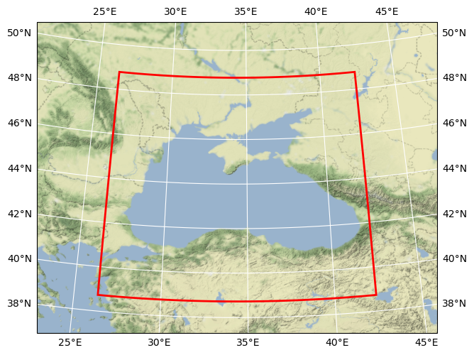

# CMEMS SST Black Sea

## Basic information

 
Map tiles by <a href="http://stamen.com">Stamen Design</a>, under <a href="http://creativecommons.org/licenses/by/3.0">CC BY 3.0</a>. Data by <a href="http://openstreetmap.org">OpenStreetMap</a>, under <a href="http://www.openstreetmap.org/copyright">ODbL</a>.

| Creator | ISMAR - Institute of Marine Sciences (CNR - ISMAR - GOS - Rome) |
## Variable list

| Variable | Identifier | Units |
| ---- | ---- | ---- |
| [Analysed Sea Surface Temperature](#analysed\_sst) | analysed\_sst | K |

## Full variable metadata

### Analysed Sea Surface Temperature

| Field | Value |
| ---- | ---- |
| \_ChunkSizes | 1, 200, 321 |
| comment | \[1981\-present\] Optimal interpolation \(OI\) SST measurements from ESA CCI SST v2\.0, C3S v\.2\.0 and PFV53 |
| long\_name | Analysed Sea Surface Temperature |
| source | [Click here for source.](cmems_SST_BS_SST_L4_REP_OBSERVATIONS_010_022_1653926779692.zarr-analysed_sst.md) |
| standard\_name | sea\_surface\_temperature |
| type | foundation |
| units | K |
| valid\_max | 313 |
| valid\_min | 263 |

## Full dataset metadata

| Field | Value |
| ---- | ---- |
| Conventions | CF\-1\.4 |
| DSD\_entry\_id | \-GOS\-L4HRfnd\-BLK |
| History | Translated to CF\-1\.0 Conventions by Netcdf\-Java CDM \(CFGridWriter2\)
Original Dataset = cmems\_SST\_BS\_SST\_L4\_REP\_OBSERVATIONS\_010\_022; Translation Date = 2022\-05\-30T16:06:19\.789Z |
| Metadata\_Conventions | Unidata Dataset Discovery v1\.0 |
| Scaling\_Equation | \(scale\_factor\*data\) \+ add\_offset |
| acknowledgment | Please acknowledge the use of these data with the following statement: Generated/provided by Copernicus Marine Service and CNR \- ISMAR ROME\. We would also appreciate being informed of any publications\. |
| cdm\_data\_type | grid |
| comment | WARNING: some applications are unable to properly handle byte values\. If Values >127 are encounterd, please subtract 256 |
| creator\_email | gsdk@isac\.cnr\.it |
| creator\_name | ISMAR \- Institute of Marine Sciences \(CNR \- ISMAR \- GOS \- Rome\) |
| creator\_url | [http://gosweb\.artov\.isac\.cnr\.it/](http://gosweb.artov.isac.cnr.it/) |
| date\_created | 20220526T093427Z |
| easternmost\_longitude | 42.375 |
| file\_quality\_level | 3 |
| gds\_version\_id | v2\.0\.5 |
| geospatial\_lat\_max | 48.775001525878906 |
| geospatial\_lat\_min | 38.724998474121094 |
| geospatial\_lat\_resolution | 0.05000000074505806 |
| geospatial\_lat\_units | degrees\_north |
| geospatial\_lon\_max | 42.375 |
| geospatial\_lon\_min | 26.375 |
| geospatial\_lon\_resolution | 0.05000000074505806 |
| geospatial\_lon\_units | degrees\_east |
| history | GOS\-CMEMS processor V4: new version |
| id |   |
| institution | GOS |
| keywords | Oceans > Ocean Temperature > Sea Surface Temperature |
| keywords\_vocabulary | NASA Global Change Master Directory \(GCMD\) Science Keywords |
| license | free registration at Copernicus Marine Service \(http://marine\.copernicus\.eu/web/56\-user\-registration\-form\.php\) |
| metadata\_link | Link to collection metadata record at archive |
| naming\_authority | org\.ghrsst |
| netcdf\_version\_id | 4\.1\.1, build date: JUN 18 2010" |
| northernmost\_latitude | 48.775001525878906 |
| platform | NOAA AVHRR, Metop\-A AVHRR, \(A\)ATSR, Sentinel\-3A SLSTR series of sensors |
| processing\_level | L4 |
| product\_version | 3\.0 |
| project | Copernicus Marine Environment Monitoring Service \(CMEMS\) |
| publisher\_email | servicedesk\.cmems@mercator\-ocean\.eu, gsdk@isac\.cnr\.it |
| publisher\_name | CNR ISMAR GOS \- CMEMS SST\-TAC |
| publisher\_url | [http://marine\.copernicus\.eu/](http://marine.copernicus.eu/) |
| references | A\. Pisano, B\. Buongiorno Nardelli, C\. Tronconi, R\. Santoleri: The new Mediterranean optimally interpolated pathfinder AVHRR SST Dataset \(1982\-2012\)\. /Remote Sensing of Environment\./ 176 \(2016\) 107\-116, doi:10\.1016/j\.rse\.2016\.01\.019; http://pathfinder\.nodc\.noaa\.gov and Casey, K\.S\., T\.B\. Brandon, P\. Cornillon, and R\. Evans: The Past, Present and Future of the AVHRR Pathfinder SST Program, in Oceanography from Space: Revisited, eds\. V\. Barale, J\.F\.R\. Gower, and L\. Alberotanza, Springer, 2010\. DOI: 10\.1007/978\-90\-481\-8681\-5\_16\. |
| sensor | \[1981\-2018\] NOAA AVHRR series of sensors \(NOAA\-07/09/11/12/14/15/16/17/18/19\), ATSR1, ATSR2, \(A\)ATSR, MetopA AVHRR; \[2017\-present\] MetopA AVHRR, SLSTR\-3A, SLSTR\-3B; |
| software\_version | Copernicus Marine Service HR L4 Processor V\.2 |
| source | \[1981\-2016\] ESA CCI SST v\.2\.0 L3C product \(SST at 0\.2m\); \[2017\-present\] C3S v\.2\.0 L3C product \(SST at 0\.2m\); \[1981\-2014\]  Pathfinder\-PFV5\.3 L3C product \(SST skin\) |
| southernmost\_latitude | 38.724998474121094 |
| spatial\_resolution | 0\.05 degree |
| standard\_name\_vocabulary | NetCDF Climate and Forecast \(CF\) Metadata Convention |
| start\_time | 20211125T190000Z |
| stop\_time | 20211126T070000Z |
| summary | \[1981\-present\] Daily gap\-free maps \(L4\) at 0\.05deg\. x 0\.05deg\. horizontal resolution over the Black Sea\. The maps are obtained using nighttime data extracted from ESA CCI SST v\.2\.0, C3S v\.2\.0 and PFV53 data |
| time\_coverage\_end | 20211126T070000Z |
| time\_coverage\_start | 20211125T190000Z |
| title | CMEMS SST Black Sea |
| uuid |   |
| westernmost\_longitude | 26.375 |

