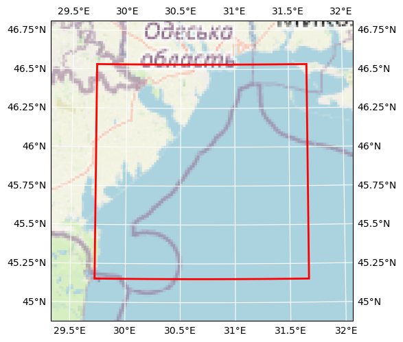

# DOORS UPC Dniester Coastal (rho values)

## Basic information

 
Map tiles by <a href="http://stamen.com">Stamen Design</a>, under <a href="http://creativecommons.org/licenses/by/3.0">CC BY 3.0</a>. Data by <a href="http://openstreetmap.org">OpenStreetMap</a>, under <a href="http://www.openstreetmap.org/copyright">ODbL</a>.

| Parameter | Value |
| ---- | ---- |
| Bounding box latitude | 46.531418 to 45.151418 |
| Bounding box longitude | 29.721789178418994 to 31.668789178418994 |
| Time range | 2016-10-05T00:00:00 to 2016-10-05T00:00:00 |
| Contributor | UPC |
| Creator | Brockmann Consult GmbH |

[Click here for full dataset metadata.](#full-metadata)

## Variable list

| Variable | Identifier | Units |
| ---- | ---- | ---- |
| [wind\-induced wave direction \- mean](#Dwave) | Dwave | degrees |
| [wind\-induced wave direction \-  peak](#Dwavep) | Dwavep | degrees |
| [wind\-induced significant wave height](#Hwave) | Hwave | meter |
| [wind\-induced bottom wave Period](#Pwave\_bot) | Pwave\_bot | second |
| [wind\-induced peak surface wave Period](#Pwave\_top) | Pwave\_top | second |
| [angle between XI\-axis and EAST](#angle) | angle | radians |
| [Coriolis parameter at RHO\-points](#f) | f | second\-1 |
| [bathymetry at RHO\-points](#h) | h | meter |
| [mask on RHO\-points](#mask\_rho) | mask\_rho | \[none\] |
| [curvilinear coordinate metric in XI](#pm) | pm | meter\-1 |
| [curvilinear coordinate metric in ETA](#pn) | pn | meter\-1 |
| [salinity](#salt) | salt | \[none\] |
| [potential temperature](#temp) | temp | Celsius |
| [free\-surface](#zeta) | zeta | meter |

## Full variable metadata

### wind-induced wave direction - mean

| Field | Value |
| ---- | ---- |
| field | Dwave, scalar, series |
| grid | grid |
| location | face |
| long\_name | wind\-induced wave direction \- mean |
| time | ocean\_time |
| units | degrees |

### wind-induced wave direction -  peak

| Field | Value |
| ---- | ---- |
| field | Dwavep, scalar, series |
| grid | grid |
| location | face |
| long\_name | wind\-induced wave direction \-  peak |
| time | ocean\_time |
| units | degrees |

### wind-induced significant wave height

| Field | Value |
| ---- | ---- |
| field | Hwave, scalar, series |
| grid | grid |
| location | face |
| long\_name | wind\-induced significant wave height |
| time | ocean\_time |
| units | meter |

### wind-induced bottom wave Period

| Field | Value |
| ---- | ---- |
| field | Pwave\_bot, scalar, series |
| grid | grid |
| location | face |
| long\_name | wind\-induced bottom wave Period |
| time | ocean\_time |
| units | second |

### wind-induced peak surface wave Period

| Field | Value |
| ---- | ---- |
| field | Pwave\_top, scalar, series |
| grid | grid |
| location | face |
| long\_name | wind\-induced peak surface wave Period |
| time | ocean\_time |
| units | second |

### angle between XI-axis and EAST

| Field | Value |
| ---- | ---- |
| field | angle, scalar |
| grid | grid |
| location | face |
| long\_name | angle between XI\-axis and EAST |
| units | radians |

### Coriolis parameter at RHO-points

| Field | Value |
| ---- | ---- |
| field | coriolis, scalar |
| grid | grid |
| location | face |
| long\_name | Coriolis parameter at RHO\-points |
| units | second\-1 |

### bathymetry at RHO-points

| Field | Value |
| ---- | ---- |
| field | bath, scalar |
| grid | grid |
| location | face |
| long\_name | bathymetry at RHO\-points |
| units | meter |

### mask on RHO-points

| Field | Value |
| ---- | ---- |
| flag\_meanings | land water |
| flag\_values | 0.0, 1.0 |
| grid | grid |
| location | face |
| long\_name | mask on RHO\-points |

### curvilinear coordinate metric in XI

| Field | Value |
| ---- | ---- |
| field | pm, scalar |
| grid | grid |
| location | face |
| long\_name | curvilinear coordinate metric in XI |
| units | meter\-1 |

### curvilinear coordinate metric in ETA

| Field | Value |
| ---- | ---- |
| field | pn, scalar |
| grid | grid |
| location | face |
| long\_name | curvilinear coordinate metric in ETA |
| units | meter\-1 |

### salinity

| Field | Value |
| ---- | ---- |
| field | salinity, scalar, series |
| grid | grid |
| location | face |
| long\_name | salinity |
| time | ocean\_time |

### potential temperature

| Field | Value |
| ---- | ---- |
| field | temperature, scalar, series |
| grid | grid |
| location | face |
| long\_name | potential temperature |
| time | ocean\_time |
| units | Celsius |

### free-surface

| Field | Value |
| ---- | ---- |
| field | free\-surface, scalar, series |
| grid | grid |
| location | face |
| long\_name | free\-surface |
| time | ocean\_time |
| units | meter |

## Full dataset metadata

| Field | Value |
| ---- | ---- |
| CDI | Climate Data Interface version 1\.9\.9rc1 \(https://mpimet\.mpg\.de/cdi\) |
| CDO | Climate Data Operators version 1\.9\.9rc1 \(https://mpimet\.mpg\.de/cdo\) |
| CPP\_options | CSTDNI, ANA\_BSFLUX, ANA\_BTFLUX, ASSUMED\_SHAPE, ATM\_PRESS, \!BOUNDARY\_A BULK\_FLUXES, \!COLLECT\_ALL\.\.\., CURVGRID, DJ\_GRADPS, DOUBLE\_PRECISION, EMINUSP, GLS\_MIXING, KANTHA\_CLAYSON, MASKING, MCT\_LIB, MIX\_GEO\_TS, MIX\_S\_UV, MPI, NONLINEAR, NONLIN\_EOS, N2S2\_HORAVG, PERFECT\_RESTART, POWER\_LAW, PROFILE, K\_GSCHEME, RADIATION\_2D, REDUCE\_ALLGATHER, RI\_SPLINES, \!RST\_SINGLE, SALINITY, SOLAR\_SOURCE, SOLVE3D, SPHERICAL, SPLINES\_VDIFF, SPLINES\_VVISC, SWAN\_COUPLING, TS\_DIF4, UV\_ADV, UV\_COR, UV\_U3HADVECTION, UV\_SADVECTION, UV\_LOGDRAG, UV\_VIS2, VAR\_RHO\_2D, WAVES\_OCEAN |
| Conventions | CF\-1\.4, SGRID\-0\.3 |
| NLM\_LBC | 
EDGE:  WEST   SOUTH  EAST   NORTH  
zeta:  Che    Che    Che    Clo    
ubar:  Shc    RadNud Shc    Clo    
vbar:  RadNud Shc    RadNud Clo    
u:     RadNud RadNud RadNud Clo    
v:     RadNud RadNud RadNud Clo    
temp:  RadNud RadNud RadNud Clo    
salt:  RadNud RadNud RadNud Clo    
tke:   Gra    Gra    Gra    Gra |
| NLM\_TADV | 
ADVECTION:   HORIZONTAL   VERTICAL     
temp:        Upstream3    Centered4    
salt:        Upstream3    Centered4 |
| acknowledgment | DOORS project |
| ana\_file | ROMS/Functionals/ana\_btflux\.h |
| bry\_file\_01 | RMS/in/bry\_05102016\_30102016\.nc |
| code\_dir | /home/marc/Models/COAWST\_EUROSEA |
| compiler\_command | /usr/bin/mpif90 |
| compiler\_flags | \-frepack\-arrays \-O2 \-O3 \-fbounds\-check \-ftree\-vectorize \-ftree\-loop\-linear \-funroll\-loops \-w \- |
| compiler\_system | gfortran |
| contributor\_name | UPC |
| contributor\_url | [https://www\.upc\.edu/en](https://www.upc.edu/en) |
| cpu | x86\_64 |
| creator\_email | info@brockmann\-consult\.de |
| creator\_name | Brockmann Consult GmbH |
| creator\_url | [www\.brockmann\-consult\.de](http://www.brockmann-consult.de) |
| date\_modified | 2023\-02\-08T19:52:14 |
| doors\_cube\_gen\_version | 0\.1 |
| format | netCDF\-3 64bit offset file |
| frc\_file\_01 | RMS/in/frc\_DNI\_01102016\_31102016\.nc |
| geospatial\_lat\_max | 45.151418 |
| geospatial\_lon\_max | 31.668789178418994 |
| geospatial\_lat\_min | 46.531418 |
| geospatial\_lon\_min | 29.721789178418994 |
| grd\_file | RMS/in/grd\_CSTDNI\.nc |
| header\_dir | /home/marc/Models/COAWST\_EUROSEA/Projects/DOORS |
| header\_file | cstdni\_cwst\.h |
| his\_base | RMS/out/coawst\_his |
| history | Tue Jan 24 11:04:04 2023: cdo seltimestep,1/1 coawst\_his\_00001\.nc coawst\_his\_sample\.nc
ROMS/TOMS, Version 3\.8, Thursday \- July 7, 2022 \- 12:14:41 PM |
| ini\_file | RMS/in/ini\_05102016\.nc |
| orig\_file\_name | RMS/out/coawst\_his\_00001\.nc |
| os | Linux |
| project | DOORS |
| recipe | [https://github\.com/bcdev/doors\-recipes/cubegen/UPC](https://github.com/bcdev/doors-recipes/cubegen/UPC) |
| rst\_file | RMS/out/coawst\_rst\.nc |
| tiling | 002x002 |
| time\_coverage\_end | 2016\-10\-05T00:00:00 |
| time\_coverage\_start | 2016\-10\-05T00:00:00 |
| title | DOORS UPC Dniester Coastal \(rho values\) |
| type | ROMS/TOMS history file |
| var\_info | /home/marc/Models/COAWST\_EUROSEA/ROMS/External/varinfo\.dat |

