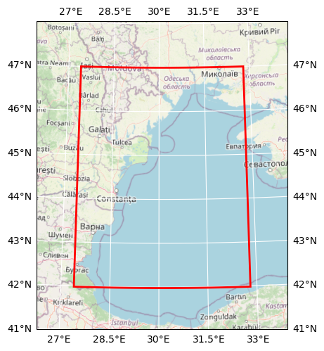

# DOORS ISMAR-CNR Western BS Hydro 3D Characterization

## Basic information

 
Map tiles and Data by <a href="http://openstreetmap.org">OpenStreetMap</a>, under <a href="http://www.openstreetmap.org/copyright">ODbL</a>.

| Parameter | Value |
| ---- | ---- |
| Bounding box latitude | 41.97999954223633 to 47.0 |
| Bounding box longitude | 27.399999618530273 to 32.79999923706055 |
| Time range | 2020-01-01T00:00:00 to 2020-01-02T00:00:00 |
| Time period | 3H |
| Contributor | ISMAR-CNR |
| Creator | Brockmann Consult GmbH |

[Click here for full dataset metadata.](#full-metadata)

## Variable list

| Variable | Identifier | Units |
| ---- | ---- | ---- |
| [depth](#lev) | lev | m |
| [sea\\\_floor\\\_depth\\\_below\\\_sea\\\_surface](#total\_depth) | total\_depth | m |
| [eastward\\\_sea\\\_water\\\_velocity](#u\_velocity) | u\_velocity | m s\-1 |
| [northward\\\_sea\\\_water\\\_velocity](#v\_velocity) | v\_velocity | m s\-1 |
| [water\\\_surface\\\_height\\\_above\\\_reference\\\_datum](#water\_level) | water\_level | m |

## Full variable metadata

### depth

| Field | Value |
| ---- | ---- |
| axis | Z |
| description | bottom of vertical layers |
| positive | down |
| standard\_name | depth |
| units | m |

### sea_floor_depth_below_sea_surface

| Field | Value |
| ---- | ---- |
| description | total depth at data grid nodes |
| standard\_name | sea\_floor\_depth\_below\_sea\_surface |
| units | m |
| valid\_max | 10000.0 |
| valid\_min | -100.0 |

### eastward_sea_water_velocity

| Field | Value |
| ---- | ---- |
| standard\_name | eastward\_sea\_water\_velocity |
| units | m s\-1 |
| valid\_max | 10.0 |
| valid\_min | -10.0 |

### northward_sea_water_velocity

| Field | Value |
| ---- | ---- |
| standard\_name | northward\_sea\_water\_velocity |
| units | m s\-1 |
| valid\_max | 10.0 |
| valid\_min | -10.0 |

### water_surface_height_above_reference_datum

| Field | Value |
| ---- | ---- |
| standard\_name | water\_surface\_height\_above\_reference\_datum |
| units | m |
| valid\_max | 10.0 |
| valid\_min | -10.0 |

## Full dataset metadata

| Field | Value |
| ---- | ---- |
| Conventions | CF\-1\.4 |
| acknowledgment | DOORS project |
| comment | Data restriction: for academic research use only |
| contact | email: georg\.umgiesser@ismar\.cnr\.it |
| contributor\_name | ISMAR\-CNR |
| contributor\_url | [http://www\.ismar\.cnr\.it/](http://www.ismar.cnr.it/) |
| creator\_email | info@brockmann\-consult\.de |
| creator\_name | Brockmann Consult GmbH |
| creator\_url | [www\.brockmann\-consult\.de](http://www.brockmann-consult.de) |
| date\_modified | 2023\-02\-08T19:45:40 |
| doors\_cube\_gen\_version | 0\.1 |
| geospatial\_lat\_max | 47.0 |
| geospatial\_lat\_min | 41.97999954223633 |
| geospatial\_lon\_max | 32.79999923706055 |
| geospatial\_lon\_min | 27.399999618530273 |
| history | created on 2022\-11\-22 14:49:30 MET |
| institution | ISMAR\-CNR, Venice, Italy |
| project | DOORS |
| recipe | [https://github\.com/bcdev/doors\-recipes/cubegen/ISMAR\-CNR](https://github.com/bcdev/doors-recipes/cubegen/ISMAR-CNR) |
| references | Model info: http://www\.ismar\.cnr\.it/shyfem |
| source | Model data produced by SHYFEM at ISMAR\-CNR |
| time\_coverage\_end | 2020\-01\-02T00:00:00 |
| time\_coverage\_start | 2020\-01\-01T00:00:00 |
| time\_period | 3H |
| title | DOORS ISMAR\-CNR Western BS Hydro 3D Characterization |

